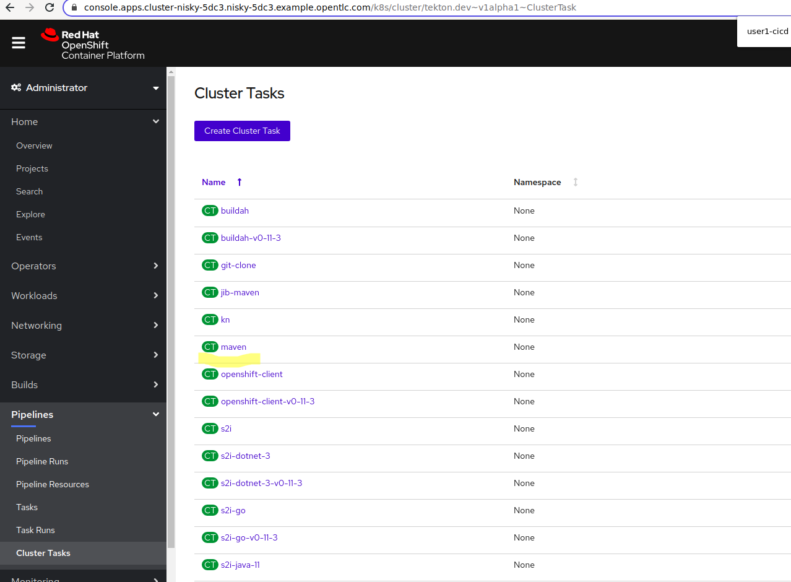
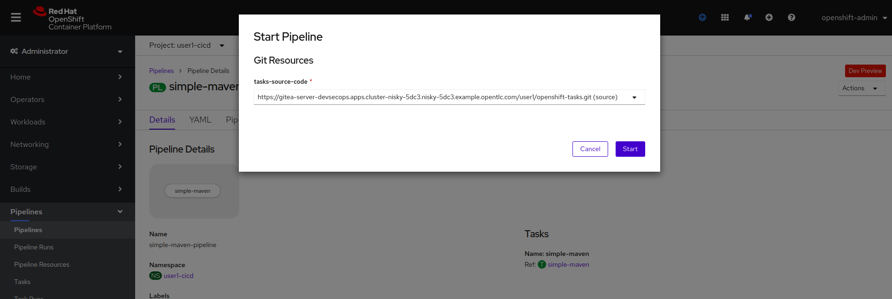
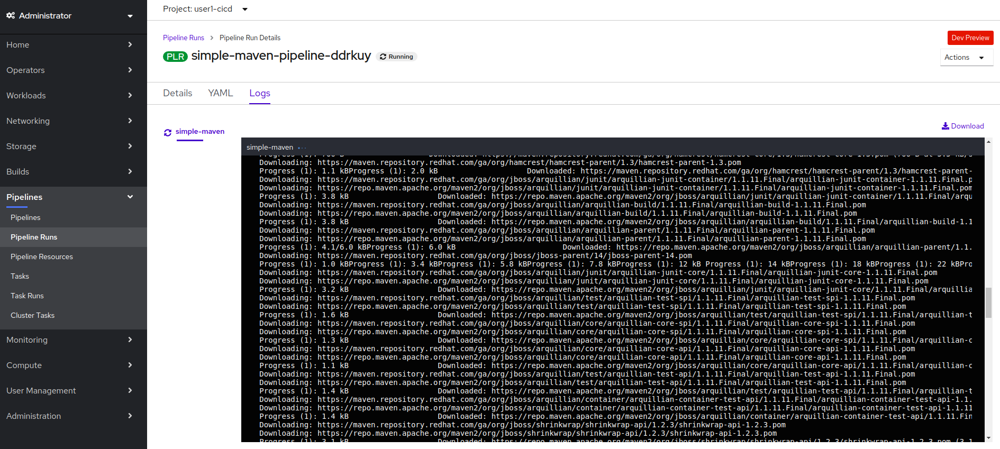

# Introduction

In this lab we will take our first steps in starting our DevSecOps pipeline. In doing so, we will not only end up with a working pipeline that performs a basic action on our project, but we will also discover a few ways to experiment and work with and learn about Tekton

# First Steps - Create a Resource for the Project

The project that we're working with is stored in a Git repository. The way Tekton uses Git repositories is by using a Git pipeline resource pointing to our source code repository. 

Let's figure out how to create a new Git pipeline resource:
```bash
$ tkn --help
CLI for tekton pipelines

Usage:
  tkn [command]

Available Commands:
  clustertask           Manage clustertasks
  clustertriggerbinding Manage clustertriggerbindings
  condition             Manage conditions
  eventlistener         Manage eventlisteners
  pipeline              Manage pipelines
  pipelinerun           Manage pipelineruns
  resource              Manage pipeline resources
  task                  Manage tasks
  taskrun               Manage taskruns
  triggerbinding        Manage triggerbindings
  triggertemplate       Manage triggertemplates

Other Commands:
  completion            Prints shell completion scripts
  version               Prints version information

Flags:
  -h, --help   help for tkn

Use "tkn [command] --help" for more information about a command.
```

The tkn cli tells us what resources we can interact with. We know that we want to create a pipeline resource, so let's see how it can help us with that. 

```bash
$ tkn resource --help
Manage pipeline resources

Usage:
  tkn resource [command]

Aliases:
  resource, res, resources

Available Commands:
  create      Create a pipeline resource in a namespace
  delete      Delete pipeline resources in a namespace
  describe    Describes a pipeline resource in a namespace
  list        Lists pipeline resources in a namespace

Flags:
  -c, --context string      name of the kubeconfig context to use (default: kubectl config current-context)
  -h, --help                help for resource
  -k, --kubeconfig string   kubectl config file (default: $HOME/.kube/config)
  -n, --namespace string    namespace to use (default: from $KUBECONFIG)
  -C, --nocolour            disable colouring (default: false)
```

Before we create the new Pipeline Resource, let's get the URL of the gitea server instance:
```bash
oc get route -n devsecops gitea-server
NAME           HOST/PORT                                                                       PATH   SERVICES       PORT    TERMINATION     WILDCARD
gitea-server   gitea-server-devsecops.apps.cluster-nisky-0450.nisky-0450.example.opentlc.com          gitea-server   <all>   edge/Redirect   None

```

So, the command we need is `create`. Then, let's create a new resource:
```bash
$ tkn resource create
? Enter a name for a pipeline resource : tasks-source
? Select a resource type to create :  [Use arrows to move, type to filter]
  cloudEvent
  cluster
> git
  image
  pullRequest
  storage
? Select a resource type to create : git
? Enter a value for url :  https://<your-gitea-server-route>/user1/openshift-tasks.git
? Enter a value for revision :  dso4
New git resource "tasks-source" has been created
```

So, now we know how to create pipeline resources. We could have similarly created the Pipeline Resource using yaml
```yaml
apiVersion: tekton.dev/v1alpha1
kind: PipelineResource
metadata:
  name: tasks-source
spec:
  params:
    - name: url
      value: >-
        https://<gitea-server-route-url>/user1/openshift-tasks.git
    - name: revision
      value: dso4
  type: git
```
The additional options for specifying the Git Pipeline Resource are on the [Tekton github page](https://github.com/tektoncd/pipeline/blob/master/docs/resources.md#git-resource)


# Explore Tasks Catalog 

Then, the Tasks application is built using Maven, so we will need to find a container that has maven inside so that we can use it to build our application. 

The first place we can look is the Cluster Task catalog that exists in OpenShift. 



So, let's see what this ClusterTask is all about. 
```bash
[akochnev@localhost workshops]$ tkn clustertask describe maven
Name:   maven

📨 Input Resources

 No input resources

📡 Output Resources

 No output resources

⚓ Params

 NAME                      TYPE     DESCRIPTION              DEFAULT VALUE
 ∙ GOALS                   array    maven goals to run       [package]
 ∙ MAVEN_MIRROR_URL        string   The Maven repositor...   
 ∙ PROXY_USER              string   The username for th...   
 ∙ PROXY_PASSWORD          string   The password for th...   
 ∙ PROXY_PORT              string   Port number for the...   
 ∙ PROXY_HOST              string   Proxy server Host        
 ∙ PROXY_NON_PROXY_HOSTS   string   Non proxy server ho...   
 ∙ PROXY_PROTOCOL          string   Protocol for the pr...   http

🦶 Steps

 ∙ mvn-settings
 ∙ mvn-goals

```
Based on the above, we could run the cluster task with the following TaskRun. Unfortunately, at this time, creating a Task Run from the UI is not supported, so we'll build our own YAML (while inspecting the details of the [Task Runs docs in Tekton](https://github.com/tektoncd/pipeline/blob/master/docs/taskruns.md)):
```yaml
apiVersion: tekton.dev/v1beta1
kind: TaskRun
metadata:
  generateName: maven-example-
spec:
  taskRef:
    kind: ClusterTask
    name: maven
```
However, doing that fails - what's happening here ? 
```bash
$ tkn tr ls
NAME                                                         STARTED          DURATION     STATUS
maven-example-k9bhw                                          1 
... snipped for brevity ...
$ tkn tr logs maven-example-k9bhw
task maven has failed: bound workspaces did not match declared workspaces: didn't provide required values: [source maven-settings]
Error: pod for taskrun maven-example-k9bhw not available yet

```

Well, well - the error message complains about workspaces not being provided. If we inspected the ClusterTask we would see that it specifies two workspaces that need to be provided to use this cluster task:
* source
* maven-settings

Let's give it some empty workspaces and see if we can make it run.

```
apiVersion: tekton.dev/v1beta1
kind: TaskRun
metadata:
  generateName: maven-example-
spec:
  taskRef:
    kind: ClusterTask
    name: maven
  params:
    - name: GOALS
      value: 
      - clean
      - package
  workspaces:
    - name: maven-settings
      emptyDir: {}
    - name: source
      emptyDir: {}

```


If we create this TaskRun and show the logs from running it, we will see an error message that there is no POM file in /workspace/source. Duh! Of course - we gave this task an empty directory as the "source" workspace, of course it will not be able to build our source - there is nothing there !!! 

```bash
$ tkn tr list
NAME                                                         STARTED         DURATION     STATUS
maven-example-2pcnw                                          1 minute ago    37 seconds   Failed
... snipped for brevity ... 

$ tkn tr logs maven-example-2pcnw
... snipped for brevity ... 
[mvn-goals] [INFO] Scanning for projects...
[mvn-goals] [INFO] ------------------------------------------------------------------------
[mvn-goals] [INFO] BUILD FAILURE
[mvn-goals] [INFO] ------------------------------------------------------------------------
... snipped for brevity ... 
------------------------------------------------------------------------
[mvn-goals] [ERROR] The goal you specified requires a project to execute but there is no POM in this directory (/workspace/source). Please verify you invoked Maven from the correct directory. -> [Help 1]
... snipped for brevity ...
container step-mvn-goals has failed  : [{"key":"StartedAt","value":"2020-07-20T22:08:06Z","resourceRef":{}}]
```

So, while the ClusterTask seemed like a decent first pass at how to build our app, it appears this might require a bit more knowledge to use this ClusterTask (e.g. we will need to have a prior task that puts the Git repo into the `source` workspace). Let's put this on ice for a bit and explore. 

# Local Containers : Experimentation and Feedback loops

OK, now we're back to the drawing board - we couldn't use the ClusterTask out of the box with our existing knowledge, but let's see what we can learn from it. 

First off, let's talk about the importance of feedback loops. As an engineer, you always want to have a short and tight feedback loop. The tighter the feedback loop, the faster you could experiment, and then the faster you could learn. From experience, the tightest feedback loop happens when engineers can play with things locally on their workstations. How could we do that with Tekton ? Luckily, since Tekton is based entirely on running containers, we have a way ! 

First of all, we can see exactly what container image the ClusterTask uses : `gcr.io/cloud-builders/mvn` . So, if we're curious, we pull down that image and explore it using it just like any other container. We will check what version of Maven is in there using `mvn -version`, and then we will `exit`:
```shell
$ podman run -it --entrypoint /bin/bash gcr.io/cloud-builders/mvn
```
Let's see what Java and Maven are in there : 
```bash
bash-4.2# mvn -version
Apache Maven 3.6.3 (cecedd343002696d0abb50b32b541b8a6ba2883f)
Maven home: /usr/share/maven
Java version: 14.0.1, vendor: Oracle Corporation, runtime: /usr/java/openjdk-14
Default locale: en_US, platform encoding: UTF-8
OS name: "linux", version: "5.6.19-300.fc32.x86_64", arch: "amd64", family: "unix"
bash-4.2# exit
exit
```

OK, so this container uses Java 14, and our tasks app uses Java 8. This might be an issue, but we can table this issue for now and see how things go. Let's clone our `tasks` git repo and see if we can build it with this Maven container. 

```bash
$ git clone -b dso4 https://gitea-server-devsecops.apps.cluster-nisky-5dc3.nisky-5dc3.example.opentlc.com/user1/openshift-tasks.git openshift-tasks-dso4
Cloning into 'openshift-tasks-dso4'...
remote: Enumerating objects: 767, done.
remote: Counting objects: 100% (767/767), done.
remote: Compressing objects: 100% (369/369), done.
remote: Total 767 (delta 286), reused 767 (delta 286)
Receiving objects: 100% (767/767), 1.93 MiB | 4.35 MiB/s, done.
Resolving deltas: 100% (286/286), done
```

So, now I've cloned the git repo into my local workstation into the openshift-tasks-dso4 directory. Now I can try to re-run the Maven container and mount that directory:
* I'm mounting it into the /workspace/source directory because that's where normally tekton would mount a PipelineResource named `source` . When I'm experimenting with this image to build my sources, I want to make it as similar as I can to how Tekton will run it, so that it's super easy for me to make it work in Tekton afterwards
* I'm also adding the :Z option on the mount to appease SELinux

```bash
podman run -v $(pwd)/openshift-tasks-dso4:/workspace/source:Z -it --entrypoint /bin/bash gcr.io/cloud-builders/mvn
bash-4.2# ls /workspace/source/
app-template.yaml  configuration  pipeline-bc.yaml  pom.xml  README.md  src
bash-4.2# mvn clean package -f /workspace/source/pom.xml
```

Woo-hoo!!! I verified that my app source code is in the /workspace/source directory, and I can run the build. The build runs for a while and.... Womp, womp ! It fails with a Java compile error !!!

```shell
[ERROR] /workspace/source/src/main/java/org/jboss/as/quickstarts/tasksrs/model/Task.java:[137,16] cannot find symbol
  symbol:   variable JAXB
  location: class org.jboss.as.quickstarts.tasksrs.model.Task
[INFO] 18 errors 
[INFO] -------------------------------------------------------------
[INFO] ------------------------------------------------------------------------
[INFO] BUILD FAILURE
[INFO] ------------------------------------------------------------------------
[INFO] Total time:  01:55 min
[INFO] Finished at: 2020-07-20T23:15:57Z
[INFO] ------------------------------------------------------------------------
[ERROR] Failed to execute goal org.apache.maven.plugins:maven-compiler-plugin:3.8.0:compile (default-compile) on project jboss-tasks-rs: Compilation failure: Compilation failure: 
[ERROR] /workspace/source/src/main/java/org/jboss/as/quickstarts/tasksrs/model/User.java:[31,33] package javax.xml.bind.annotation does not exist

```

It looks like we can't use Java 14 to  build my app after all ! Let's  go and see what else might be in that `gcr.io/cloud-builders/mvn`


Well, well - it looks like there is a Java 8 image there after all. Let's give that another try with a local container, we just have to use the `3.5.0-jdk-8` label and see that we can build our project.
```bash
$ podman run -v $(pwd)/openshift-tasks-dso4:/workspace/source:Z -it --entrypoint /bin/bash gcr.io/cloud-builders/mvn:3.5.0-jdk-8

bash-4.2# mvn clean package -f /workspace/source/pom.xml
[INFO] Scanning for projects...
Downloading: https://maven.repository.redhat.com/ga/org/jboss/bom/jboss-eap-javaee7/7.0.1.GA/jboss-eap-javaee7-7.0.1.GA.pom
... snipped for brevity ... 
[INFO] Building war: /workspace/source/target/openshift-tasks.war
[INFO] WEB-INF/web.xml already added, skipping
[INFO] ------------------------------------------------------------------------
[INFO] BUILD SUCCESS------------------------------------------------------------------------
------------------------------------------------------------------------

``` 

W00t, w00t !! The build runs for a little while and successfully completes - now we are getting somewhere !!! 

The big takeaways from the work so far:
* Since Tekton runs all of the tasks in pods, we can very easily experiment with the same containers locally until we see something work
* With a little bit of knowledge about how tekton works, we can mount the directories in our local containers to make it as similar as possible for when we move our work into Tekton proper

# Create standalone TaskRun

Now that we know how to use the Maven container (with the right Java version) to build our project, we can go back and have Tekton run it for us. As a first step, we will create a new TaskRun which uses an `inline` Task spec - just so that we don't have to create a separate Task object while we're still experimenting

```yaml
apiVersion: tekton.dev/v1beta1
kind: TaskRun
metadata:
  generateName: maven-java8-inline-example-
spec:
  resources:
    inputs:
      - name: source
        resourceRef:
          name: tasks-source
  taskSpec:
    resources:
      inputs:
        - name: source
          type: git
    steps:
    - name: mvn-goals
      args:
        - clean
        - package
        - -f 
        - $(inputs.resources.source.path)/pom.xml
      command:
        - /usr/bin/mvn
      image: gcr.io/cloud-builders/mvn:3.5.0-jdk-8
```
A couple of things to note in the TaskRun example above:

* Since the inline `taskSpec` still creates a Task on the fly, it still needs to have all the things that a Task needs - e.g. specifying what resources (including their types - e.g. 'git') it requires in an abstract way
* Since the `taskSpec` specifies that the Task requires a Git input resource, the TaskRun has to provide it in the `spec.resources` field. 
  Technically, we could also define that inline (using `resourceSpec` instead of `resourceRef`), but because we already declared a resource named `tasks-source` we can use that resource in the `spec.resources` field of the TaskRun using the `resourceRef` field.
* In our 'local' container execution we used a hardcoded path to the source code (`/workspace/source/pom.xml`) because that's where we had mounted the source code. While we could certainly use that with Tekton, it is a better practice to use parameter substitution for PipelineResources - e.g. a PipelineResource named `foo` will be mounted in /workspace/foo, and can be referenced using the `$(inputs.resources.foo.path)` parameter substitution. Note that we're also using the `.path` suffix after the name of the resource to get its absolute path (a little bit more Tekton resource magic from the [Tekton Git repo](https://github.com/tektoncd/pipeline/blob/master/docs/resources.md#variable-substitution))

With this, we can observe Tekton successfully run our Maven commands: 

```bash
$ tkn tr logs maven-java8-inline-example-m9tms
... snipped for brevity ...
[mvn-goals] [INFO] Packaging webapp
[mvn-goals] [INFO] Assembling webapp [jboss-tasks-rs] in [/workspace/source/target/openshift-tasks]
[mvn-goals] [INFO] Processing war project
[mvn-goals] [INFO] Copying webapp resources [/workspace/source/src/main/webapp]
[mvn-goals] [INFO] Webapp assembled in [51 msecs]
[mvn-goals] [INFO] Building war: /workspace/source/target/openshift-tasks.war
[mvn-goals] [INFO] WEB-INF/web.xml already added, skipping
[mvn-goals] [INFO] ------------------------------------------------------------------------
[mvn-goals] [INFO] BUILD SUCCESS
[mvn-goals] [INFO] ------------------------------------------------------------------------
[mvn-goals] [INFO] Total time: 46.141 s
[mvn-goals] [INFO] Finished at: 2020-07-20T23:36:45Z
[mvn-goals] [INFO] Final Memory: 32M/969M
[mvn-goals] [INFO] ------------------------------------------------------------------------
```

So now, the last step is to take our TaskSpec and move it into a standalone task:
```yaml
apiVersion: tekton.dev/v1alpha1
kind: Task
metadata:
  name: simple-maven
spec:
  resources:
      inputs:
        - name: source
          type: git
  steps:
    - name: mvn-goals
      args:
        - clean
        - package
        - -f 
        - $(inputs.resources.source.path)/pom.xml
      command:
        - /usr/bin/mvn
      image: gcr.io/cloud-builders/mvn:3.5.0-jdk-8
```

Now that we have a task, we can really simplify the TaskRun:
```yaml
apiVersion: tekton.dev/v1beta1
kind: TaskRun
metadata:
  generateName: simple-maven-
spec:
  resources:
    inputs:
      - name: source
        resourceRef:
          name: tasks-source
  taskRef:
    name: simple-maven
```

We can also see the TaskRun succeed:
```bash
$ tkn tr ls | grep simple-maven
simple-maven-nb5nj                                           2 minutes ago    2 minutes    Succeeded
$ tkn tr logs -f simple-maven-nb5nj
#... snipped for brevity ...
[mvn-goals] Downloading: https://repo.maven.apache.org/maven2/com/thoughtworks/xstream/xstream/1.3.1/xstream-1.3.1.jar
Downloaded: https://repo.maven.apache.org/maven2/org/codehaus/plexus/plexus-io/1.0.1/plexus-io-1.0.1.jar (51 kB at 2.1 MB/s)
Downloaded: https://repo.maven.apache.org/maven2/org/codehaus/plexus/plexus-archiver/1.2/plexus-archiver-1.2.jar (182 kB at 6.1 MB/s)
Downloaded: https://repo.maven.apache.org/maven2/com/thoughtworks/xstream/xstream/1.3.1/xstream-1.3.1.jar (431 kB at 11 MB/s)
[mvn-goals] [INFO] Packaging webapp
[mvn-goals] [INFO] Assembling webapp [jboss-tasks-rs] in [/workspace/source/target/openshift-tasks]
[mvn-goals] [INFO] Processing war project
[mvn-goals] [INFO] Copying webapp resources [/workspace/source/src/main/webapp]
[mvn-goals] [INFO] Webapp assembled in [54 msecs]
[mvn-goals] [INFO] Building war: /workspace/source/target/openshift-tasks.war
[mvn-goals] [INFO] WEB-INF/web.xml already added, skipping
[mvn-goals] [INFO] ------------------------------------------------------------------------
[mvn-goals] [INFO] BUILD SUCCESS
[mvn-goals] [INFO] ------------------------------------------------------------------------

```

# Add the Task into a one-step pipeline

Now that we can execute the task from the TaskRun, we can proceed and create our first pipeline. This pipeline will: 
* Declare a single Git pipeline resource that needs to be provided to it
* It will use this resource to invoke the simple-maven task
  
If we want to use the Web Console: 


Or using yaml:

```yaml
apiVersion: tekton.dev/v1alpha1
kind: Pipeline
metadata:
  name: simple-maven-pipeline
spec:
  resources:
    - name: tasks-source-code
      type: git
  tasks:
    - name: simple-maven
      resources:
        inputs:
          - name: source
            resource: tasks-source-code
      taskRef:
        kind: Task
        name: simple-maven
```

Now, starting this pipeline is pretty straightforward, even using the GUI - the Console will prompt you to specify which PipelineResource to invoke the pipeline with:



We can now observe the execution of the Pipeline Run in the Console and follow the logs:


# Conclusion

In this lab we learned how to explore what Tekton provides, and we have some easy building blocks that we can use going forward, regardless of what steps we need to build the pipeline with. In summary, the steps are as follows:
1. Find a container that has the tool that you need - be it maven, s2i, or just plain bash. 
2. Launch the container with the tool locally to figure out the details on how to interact with the tool. Here, you might need to play with some podman/docker options with mounting directories, etc. The more you can replicate some of the conventions of the Tekton environment (e.g. where resources are mounted, where workspaces end up, etc), the easier it will be to later transition to Tekton. 
3. Once you have the arguments that you need to invoke the container with, you can now experiment with a TaskRun with an inline Task - this way you can see Tekton execute your tool and you can adjust the tool parameters and perform the relevant parameter substitutions, paths, etc. 
4. Once you have a working Task, move it to a standalone Task. Confirm that the standalone Task works with a TaskRun (with all the right parameters)
5. Once you have a working standalone Task, integrate it into a Pipeline
6. Run your Pipeline

The next lab will explore further how to make a Task a reusable component. 