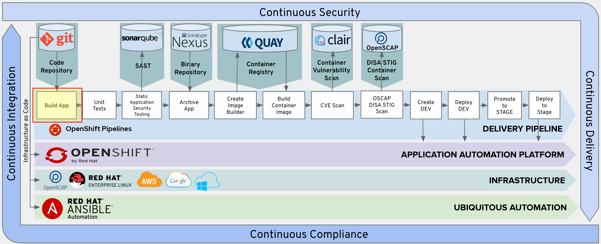

# Introduction

In this lab we will explore the steps necessary to level-up our game in working with Tekton Tasks. When we're all done, we will have the `Build` stage of our DevSecOps pipeline. 




# Review the simple-maven Task

Now, we have successfully built a simple Task, and we were able to execute that task either using a standalone TaskRun or by executing it as a part of a Pipeline (using a PipelineRun). 

Let's take another look at the task:
```yaml
apiVersion: tekton.dev/v1alpha1
kind: Task
metadata:
  name: simple-maven
spec:
  resources:
      inputs:
        - name: source
          type: git
  steps:
    - name: mvn-goals
      args:
        - clean
        - package
        - -f 
        - $(inputs.resources.source.path)/pom.xml
      command:
        - /usr/bin/mvn
      image: gcr.io/cloud-builders/mvn:3.5.0-jdk-8
```

Tasks in Tekton are expected to be reusable. A very quick re-review of our simple-maven task definition shows us that it's not. For example, each of the following can be extracted as an explicit parameter to the task:
* This task has a fixed set of Maven goals (clean, package). We might want to run a different set of Maven goals
* This task has a fixed location for the POM. We might want to point Maven to a different source location (where the project or the POM file is located)
* This task doesn't allow for passing the location of the maven settings file. We might want to explicitly pass additional arguments to Maven to provide it with a settings.xml file
* Implicitly, since there is nothing else specified, Maven will use the ~/.m2/repository directory in the pod for downloading dependencies. We might want to give the Maven task a separate workspace where the downloaded artifacts for the pipeline can be stored (so that the individual tasks in the pipeline don't have to re-download them every time)

# Improve simple-maven task

So, now that we know how we can improve the task, let's make our first reusable and production-quality Tekton task. At each step of the way, we will make an incremental change and validate that the change did not break the task by running it with a TaskRun. Whenever we're done changing the Task, we will then update our pipeline with our latest version of the Task invocation

## Parametrize Maven goals

Since our goal is to make this task as re-usable as possible (so that we can call it with different parameters from a pipeline), we want to be able to pass in more than one goal to be executed by Maven. 

When we talk about task parameters (the same applies to Pipeline parameters), Tekton is pretty simple - everythign is either a String or an array of Strings. Now, since we want to pass multiple goals to Maven, we will use an array. Additionally, since we want our Maven task to be as simple as possible to use, we will give this parameter a default value that is meaningful and simple - if you call Maven without passing a goals parameter, we would want Maven to execute the `package` goal. 

With that, this is what our task would look like:  
```yaml
apiVersion: tekton.dev/v1alpha1
kind: Task
metadata:
  name: simple-maven
spec:
  params:
    - name: GOALS
      type: array
      description: Maven goals to execute
      default:
      - package
  resources:
      inputs:
        - name: source
          type: git
  steps:
    - name: mvn-goals
      args:
        - $(params.GOALS)
        - -f 
        - $(inputs.resources.source.path)/pom.xml
      command:
        - /usr/bin/mvn
      image: gcr.io/cloud-builders/mvn:3.5.0-jdk-8
```

Since we provided a default value for the GOALS parameter, we should be able to kick off a TaskRun exactly the way we did it before:

```yaml
apiVersion: tekton.dev/v1beta1
kind: TaskRun
metadata:
  generateName: simple-maven-
spec:
  resources:
    inputs:
      - name: source
        resourceRef:
          name: tasks-source
  taskRef:
    name: simple-maven
```

... or on the command line ...

```bash
tkn task start --inputresource source=tasks-source simple-maven
Taskrun started: simple-maven-run-qdsr8

In order to track the taskrun progress run:
tkn taskrun logs simple-maven-run-qdsr8 -f -n user1-cicd

```

However, with my newfangled ability to pass in parameters, I can now start this task and pass it the goals I want to execute:
```bash
tkn task start --inputresource source=tasks-source --param GOALS=clean,compile simple-maven
```

## Adding additional parameters - POM and settings. 

As is always the case, it is always a balance of making a software component reusable and customizable vs making it simple to use. From a technical POV, if we wanted to add additional arguments to Maven, we could always add them to the GOALS parameter, but that just feels wrong. 

First off, our current maven task assumes that the pom.xml is at the root of the source tree in the `source` PipelineResource. While that is a reasonable assumption for our specific project, different maven projects might use a different location for the project. This is the first value we want to parametrize. 

If we inspect the Tasks application source repository, we will see that the source code repository has a `configuration/cicd-settings.xml` file containing some profiles, and repository settings. We want to be able to allow the passing of that path as a parameter. 

With these two parameters, this is what our updated task would look like:
```yaml
apiVersion: tekton.dev/v1alpha1
kind: Task
metadata:
  name: simple-maven
spec:
  params:
    - name: GOALS
      type: array
      description: Maven goals to execute
      default:
      - package
    - name: POM_PATH
      type: string
      description: Path to the pom.xml of the project (if located outside of the source root)
      default: pom.xml
    - name: SETTINGS_PATH
      type: string
      description: Path to the settings.xml to use in running the build
      default: 'configuration/cicd-settings-nexus3.xml'
  resources:
      inputs:
        - name: source
          type: git
  steps:
    - name: mvn-goals
      args:
        - $(params.GOALS)
        - -s
        - $(inputs.resources.source.path)/$(params.SETTINGS_PATH)
        - -f 
        - $(inputs.resources.source.path)/$(params.POM_PATH)
      command:
        - /usr/bin/mvn
      image: gcr.io/cloud-builders/mvn:3.5.0-jdk-8
```

With this updated task definition, we can run the new task in exactly the same way as before (e.g. if I didn't wanto to specify a different settings file than the default):
```bash
tkn task start --inputresource source=tasks-source --param GOALS=clean,compile simple-maven
```

Now, if we inspected the output of this run, we will see that now the Maven build takes into account the values specified in the settings file and downloads the dependencies from the internal maven repository:
```bash
$ tkn taskrun logs simple-maven-run-pcfx7 -f -n user1-cicd
[git-source-tasks-source-sng4m] {"level":"info","ts":1595343655.2471328,"caller":"git/git.go:105","msg":"Successfully cloned https://gitea-server-devsecops.apps.cluster-nisky-5dc3.nisky-5dc3.example.opentlc.com/user1/openshift-tasks.git @ dso4 in path /workspace/source"}
[git-source-tasks-source-sng4m] {"level":"info","ts":1595343655.3214984,"caller":"git/git.go:133","msg":"Successfully initialized and updated submodules in path /workspace/source"}

[mvn-goals] [INFO] Scanning for projects...
[mvn-goals] Downloading: http://nexus.devsecops.svc.cluster.local:8081/repository/maven-public/org/jboss/bom/jboss-eap-javaee7/7.0.1.GA/jboss-eap-javaee7-7.0.1.GA.pom
Downloaded: http://nexus.devsecops.svc.cluster.local:8081/repository/maven-public/org/jboss/bom/jboss-eap-javaee7/7.0.1.GA/jboss-eap-javaee7-7.0.1.GA.pom (24 kB at 57 kB/s)
```

Or, if I wanted to specify a different settings file, I could pass it as an additional param (of course, the example below would fail because the cicd-settings.xml file doesn't contain the correct configuration for a build):
```bash
tkn task start --inputresource source=tasks-source --param GOALS=clean  --param SETTINGS_PATH=configuration/cicd-settings.xml simple-maven

```


## Add Maven dependencies workspace

If we paid close attention to each of the task runs above, we will see that every time we run any of the maven goals, the build downloads a number of dependencies - needed by Maven itself to execute the goals, or needed by the application (to compile, package, etc). If we were running these builds on a local machine that would happen the first time, as these dependencies would be cached in the user profile's ~/.m2/repository directory. However, because the Tekton builds run in a new pod every time, these same dependencies are not present and Tekton needs to download them every time. 

By specifying a maven settings file for our build, we took a first step to improve the speed of the builds : now the dependencies are served from a Nexus server running in the cluster, which significantly speeds up the builds (instead of downloading from , say, the Maven Central repository on the internet). This is also helpful in "isolated" environments where the builds cannot (and should not) download dependencies from the wild internet. However, it would still be better that if we ran this build more than once, if the build didn't have to re-download any of the dependencies that it needed. 

This is where Tekton `workspaces` come into play. Workspaces provide a mechanism for sharing data between tasks by allowing TaskRuns to provide parts of the filesystem of the Pod in which the Task is running. The shared filesystem can be used for storing inputs and outputs, sharing data between tasks, etc. The full details for using workspaces is in the [Tekton Workspaces docs](https://github.com/tektoncd/pipeline/blob/master/docs/workspaces.md),and they have a number of different ways they can be created (e.g. using Kubernetes Persistent Volume Claims, secrets, config maps, etc). 

Now, Maven already provides for a way to specify the location of the local maven repository by passing in a `maven.repo.local` Java system property. So, if we wanted to have the Maven build to use a repository located in /foo/repository, you could run the build as follows:
```bash
mvn package -Dmaven.repo.local=/foo/repository
```
With that, we can now update our Maven task to use that option and declare that it needs to be given a workspace in order to operate:
```yaml
apiVersion: tekton.dev/v1alpha1
kind: Task
metadata:
  name: simple-maven
spec:
  params:
    - name: GOALS
      type: array
      description: Maven goals to execute
      default:
      - package
    - name: POM_PATH
      type: string
      description: Relative path to the pom.xml of the project (if located outside of the root of the pipeline resource)
      default: pom.xml
    - name: SETTINGS_PATH
      type: string
      description: Relative path to the settings.xml to use in running the build
      default: 'configuration/cicd-settings-nexus3.xml'
  resources:
      inputs:
        - name: source
          type: git
  workspaces:
    - name: maven-repo
      description: The local maven repository to use for caching Maven artifacts
  steps:
    - name: mvn-goals
      args:
        - $(params.GOALS)
        - -s
        - $(inputs.resources.source.path)/$(params.SETTINGS_PATH)
        - -f 
        - $(inputs.resources.source.path)/$(params.POM_PATH)
        - -Dmaven.repo.local=$(workspaces.maven-repo.path)'
      command:
        - /usr/bin/mvn
      image: gcr.io/cloud-builders/mvn:3.5.0-jdk-8
```

With this definition, we can test that we can run our Task from the command line. Note that I am using the `--showlog` command line option in Tekton so that I can see the logs from executing the task right away and don't have to run a second command to get them:
```bash
tkn task start --inputresource source=tasks-source --param GOALS=clean  --param SETTINGS_PATH=configuration/cicd-settings-nexus3.xml --workspace name=maven-repo,emptyDir='' simple-maven --showlog
```
Now, this makes the Task run successfully, but doesn't really address the problem that we had in the first place - not having to re-download the dependencies every time this task runs. Because we provide an emptyDir implementation for the workspace, it always starts with an empty directory for the repository and has to re-download the dependencies. In order to solve our specific problem, we will need to dip just a tad deeper into the world of Kubernetes using a PersistentVolumeClaims (PVCs). 

In short, a PVC allows a pod in Kubernetes to request persistent storage from the container platform. For convenience, when this workshop was created a PVC named `maven-repo-pvc`. For those who are curious, below is what it looks like. In short, it requests OpenShift to allocate a 1GB filesystem, and many containers can read and write to it. 
```yaml
  kind: PersistentVolumeClaim
  apiVersion: v1
  metadata:
    name: maven-repo-pvc
  spec:
    accessModes:
      - ReadWriteMany
    resources:
      requests:
        storage: 1G
    storageClassName: ocs-storagecluster-cephfs
    volumeMode: Filesystem

```

With that, we can re-run our task, this time with the PVC in tow. 
```bash
akochnev@localhost workshops]$ tkn task start --inputresource source=tasks-source --param GOALS=clean  --param SETTINGS_PATH=configuration/cicd-settings-nexus3.xml --workspace name=maven-repo,claimName=maven-repo-pvc simple-maven --showlog
Taskrun started: simple-maven-run-5llsm
Waiting for logs to be available...
[mvn-goals] [INFO] Scanning for projects...
[mvn-goals] Downloading: http://nexus.devsecops.svc.cluster.local:8081/repository/maven-public/org/jboss/bom/jboss-eap-javaee7/7.0.1.GA/jboss-eap-javaee7-7.0.1.GA.pom
Downloaded: http://nexus.devsecops.svc.cluster.local:8081/repository/maven-public/org/jboss/bom/jboss-eap-javaee7/7.0.1.GA/jboss-eap-javaee7-7.0.1.GA.pom (24 kB at 293 kB/s)
[mvn-goals] Downloading: http://nexus.devsecops.svc.cluster.local:8081/repository/maven-public/org/jboss/spec/jboss-javaee-7.0/1.0.3.Final-redhat-2/jboss-javaee-7.0-1.0.3.Final-redhat-2.pom
Downloaded: http://nexus.devsecops.svc.cluster.local:8081/repository/maven-public/org/jboss/spec/jboss-javaee-7.0/1.0.3.Final-redhat-2/jboss-javaee-7.0-1.0.3.Final-redhat-2.pom (19 kB at 1.2 MB/s)
[mvn-goals] Downloading: http://nexus.devsecops.svc.cluster.local:8081/repository/maven-public/org/jboss/jboss-parent/19.0.0.redhat-2/jboss-parent-19.0.0.redhat-2.pom
Downloaded: http://nexus.devsecops.svc.cluster.local:8081/repository/maven-public/org/jboss/jboss-parent/19.0.0.redhat-2/jboss-parent-19.0.0.redhat-2.pom (33 kB at 3.0 MB/s)
# ... snipped for brevity ... 
[mvn-goals] [INFO] 
[mvn-goals] [INFO] ------------------------------------------------------------------------
[mvn-goals] [INFO] Building JBoss EAP - Tasks JAX-RS App 7.0.0-SNAPSHOT
[mvn-goals] [INFO] ------------------------------------------------------------------------
[mvn-goals] Downloading: http://nexus.devsecops.svc.cluster.local:8081/repository/maven-public/org/jacoco/jacoco-maven-plugin/0.7.9/jacoco-maven-plugin-0.7.9.pom
Downloaded: http://nexus.devsecops.svc.cluster.local:8081/repository/maven-public/org/jacoco/jacoco-maven-plugin/0.7.9/jacoco-maven-plugin-0.7.9.pom (4.5 kB at 405 kB/s)
# ... snipped for brevity ... 
[mvn-goals] [INFO] ------------------------------------------------------------------------
[mvn-goals] [INFO] BUILD SUCCESS
[mvn-goals] [INFO] ------------------------------------------------------------------------
[mvn-goals] [INFO] Total time: 0.857 s
[mvn-goals] [INFO] Finished at: 2020-07-21T17:13:45Z
[mvn-goals] [INFO] Final Memory: 22M/943M
[mvn-goals] [INFO] ------------------------------------------------------------------------

```

If I run that same command again, the output is much shorter - just the results of the requested goal and none of the download output:
```bash
tkn task start --inputresource source=tasks-source --param GOALS=clean  --param SETTINGS_PATH=configuration/cicd-settings-nexus3.xml --workspace name=maven-repo,claimName=maven-repo-pvc simple-maven --showlog
Taskrun started: simple-maven-run-8562d
Waiting for logs to be available...

[mvn-goals] [INFO] Scanning for projects...
[mvn-goals] [INFO] 
[mvn-goals] [INFO] ------------------------------------------------------------------------
[mvn-goals] [INFO] Building JBoss EAP - Tasks JAX-RS App 7.0.0-SNAPSHOT
[mvn-goals] [INFO] ------------------------------------------------------------------------
[mvn-goals] [INFO] 
[mvn-goals] [INFO] --- maven-clean-plugin:2.5:clean (default-clean) @ jboss-tasks-rs ---
[mvn-goals] [INFO] ------------------------------------------------------------------------
[mvn-goals] [INFO] BUILD SUCCESS
[mvn-goals] [INFO] ------------------------------------------------------------------------
[mvn-goals] [INFO] Total time: 0.333 s
[mvn-goals] [INFO] Finished at: 2020-07-21T17:12:17Z
[mvn-goals] [INFO] Final Memory: 17M/943M
[mvn-goals] [INFO] ------------------------------------------------------------------------

```
In the second run, there are no downloads that need to happen, and the build completes in 333 ms compared with the 857 ms from the time without the workspace being populated and persistent. Almost a 3 times improvement in the build time, not bad !!! 

As a side note, the command line parameters for specifying workspaces is a bit sparse, so here are a few useful options (cribbed from the [Workspaces test corpus on Github](https://github.com/tektoncd/cli/blob/master/pkg/workspaces/workspaces_test.go)):
- Each --workspace specification on the `tkn` command line needs to include a `name=foo` argument to specify what workspace is being bound
- To specify an emptyDir, use either `emptyDir=''` , or possibly `emptyDir=Memory` options. There is more here, but this works for testing purposes
- To specify an existing PersistentVolumeClaim, use the `claimName=my-claim-name` parameter
- To specify a secret to back the workspace, you can use the `secret=foo-secret` parameter and reference the secret name. 


# Update Tekton pipeline

Now that we have figured out the details on how our refactored, parametrized, reusable task will work, we can now update our pipeline to use the task with its newest features. A few things to note:
* Just like the task, the Pipeline declares the `workspaces` (by name) that it expects to be provided at runtime
* The pipeline, in turn, passes the workspaces it has by name to the tasks that need a workspace
* Note that we are using the `GOALS` param as the 'escape-hatch' for parameters that we want to pass to Maven. If we wanted to be a bit more intentional, we could certainly add a "MAVEN_OPTS" param to the task


```yaml
apiVersion: tekton.dev/v1beta1
kind: Pipeline
metadata:
  name: tasks-pipeline
spec:
  resources:
    - name: tasks-source-code
      type: git

  workspaces:
    - name: local-maven-repo

  tasks:
    - name: build-app
      taskRef:
        kind: Task
        name: simple-maven
      params:
          - name: GOALS
            value: 
            - install
            - -DskipTests=true     
          - name: SETTINGS_PATH
            value: configuration/cicd-settings-nexus3.xml
          - name: POM_PATH
            value: pom.xml
      resources:
        inputs:
          - name: source
            resource: tasks-source-code
      workspaces:
        - name: maven-repo
          workspace: local-maven-repo

```

With all that being done, we can now kick off the pipeline and see it do its work. You will observe that with the workspace we passed in, there is no unnecessary downloading of resources from Nexus, as they are already cached in the maven repository. 

```bash
tkn pipeline start --resource tasks-source-code=tasks-source --workspace name=local-maven-repo,claimName=maven-repo-pvc tasks-pipeline --showlog
Pipelinerun started: tasks-pipeline-run-6ddwz
Waiting for logs to be available...
[build-app : git-source-tasks-source-9n7lv] {"level":"info","ts":1595353868.887183,"caller":"git/git.go:105","msg":"Successfully cloned https://gitea-server-devsecops.apps.cluster-nisky-5dc3.nisky-5dc3.example.opentlc.com/user1/openshift-tasks.git @ dso4 in path /workspace/source"}
[build-app : git-source-tasks-source-9n7lv] {"level":"info","ts":1595353868.954622,"caller":"git/git.go:133","msg":"Successfully initialized and updated submodules in path /workspace/source"}

[build-app : mvn-goals] [INFO] Scanning for projects...
[build-app : mvn-goals] [INFO] 
[build-app : mvn-goals] [INFO] ------------------------------------------------------------------------
[build-app : mvn-goals] [INFO] Building JBoss EAP - Tasks JAX-RS App 7.0.0-SNAPSHOT
[build-app : mvn-goals] [INFO] ------------------------------------------------------------------------
[build-app : mvn-goals] [INFO] 
[build-app : mvn-goals] [INFO] --- jacoco-maven-plugin:0.7.9:prepare-agent (default-prepare-agent) @ jboss-tasks-rs ---
[build-app : mvn-goals] [INFO] argLine set to -javaagent:/workspace/maven-repo/org/jacoco/org.jacoco.agent/0.7.9/org.jacoco.agent-0.7.9-runtime.jar=destfile=/workspace/source/target/jacoco.exec
[build-app : mvn-goals] [INFO] 
[build-app : mvn-goals] [INFO] --- maven-resources-plugin:2.6:resources (default-resources) @ jboss-tasks-rs ---
[build-app : mvn-goals] [INFO] Using 'UTF-8' encoding to copy filtered resources.
[build-app : mvn-goals] [INFO] Copying 1 resource
[build-app : mvn-goals] [INFO] 
[build-app : mvn-goals] [INFO] --- maven-compiler-plugin:3.8.0:compile (default-compile) @ jboss-tasks-rs ---
[build-app : mvn-goals] [INFO] Changes detected - recompiling the module!
[build-app : mvn-goals] [INFO] Compiling 11 source files to /workspace/source/target/classes
[build-app : mvn-goals] [INFO] 
[build-app : mvn-goals] [INFO] --- maven-resources-plugin:2.6:testResources (default-testResources) @ jboss-tasks-rs ---
[build-app : mvn-goals] [INFO] Using 'UTF-8' encoding to copy filtered resources.
[build-app : mvn-goals] [INFO] Copying 4 resources
[build-app : mvn-goals] [INFO] 
[build-app : mvn-goals] [INFO] --- maven-compiler-plugin:3.8.0:testCompile (default-testCompile) @ jboss-tasks-rs ---
[build-app : mvn-goals] [INFO] Changes detected - recompiling the module!
[build-app : mvn-goals] [INFO] Compiling 7 source files to /workspace/source/target/test-classes
[build-app : mvn-goals] [INFO] 
[build-app : mvn-goals] [INFO] --- maven-surefire-plugin:2.19.1:test (default-test) @ jboss-tasks-rs ---
[build-app : mvn-goals] [INFO] Tests are skipped.
[build-app : mvn-goals] [INFO] 
[build-app : mvn-goals] [INFO] --- jacoco-maven-plugin:0.7.9:report (default-report) @ jboss-tasks-rs ---
[build-app : mvn-goals] [INFO] Skipping JaCoCo execution due to missing execution data file.
[build-app : mvn-goals] [INFO] 
[build-app : mvn-goals] [INFO] --- maven-war-plugin:2.1.1:war (default-war) @ jboss-tasks-rs ---
[build-app : mvn-goals] [INFO] Packaging webapp
[build-app : mvn-goals] [INFO] Assembling webapp [jboss-tasks-rs] in [/workspace/source/target/openshift-tasks]
[build-app : mvn-goals] [INFO] Processing war project
[build-app : mvn-goals] [INFO] Copying webapp resources [/workspace/source/src/main/webapp]
[build-app : mvn-goals] [INFO] Webapp assembled in [41 msecs]
[build-app : mvn-goals] [INFO] Building war: /workspace/source/target/openshift-tasks.war
[build-app : mvn-goals] [INFO] WEB-INF/web.xml already added, skipping
[build-app : mvn-goals] [INFO] 
[build-app : mvn-goals] [INFO] --- maven-install-plugin:2.4:install (default-install) @ jboss-tasks-rs ---
[build-app : mvn-goals] [INFO] Installing /workspace/source/target/openshift-tasks.war to /workspace/maven-repo/org/jboss/quickstarts/eap/jboss-tasks-rs/7.0.0-SNAPSHOT/jboss-tasks-rs-7.0.0-SNAPSHOT.war
[build-app : mvn-goals] [INFO] Installing /workspace/source/pom.xml to /workspace/maven-repo/org/jboss/quickstarts/eap/jboss-tasks-rs/7.0.0-SNAPSHOT/jboss-tasks-rs-7.0.0-SNAPSHOT.pom
[build-app : mvn-goals] [INFO] ------------------------------------------------------------------------
[build-app : mvn-goals] [INFO] BUILD SUCCESS
[build-app : mvn-goals] [INFO] ------------------------------------------------------------------------
[build-app : mvn-goals] [INFO] Total time: 3.726 s
[build-app : mvn-goals] [INFO] Finished at: 2020-07-21T17:51:14Z
[build-app : mvn-goals] [INFO] Final Memory: 28M/662M
[build-app : mvn-goals] [INFO] ------------------------------------------------------------------------

```

# Conclusion

In this lab we explored the ways that we could make our Maven task reusable, and we created the first step of the official DevSecOps pipeline using our new-and-improved task
