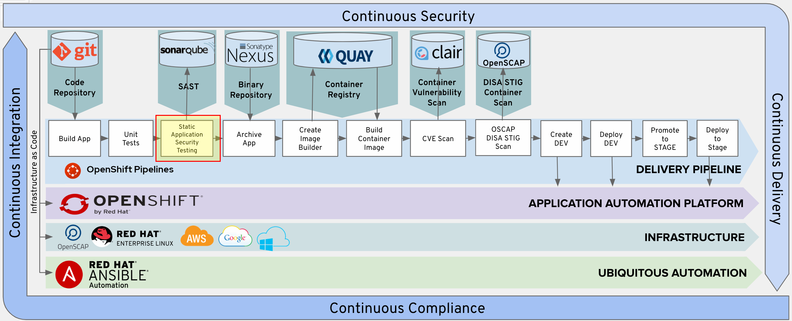
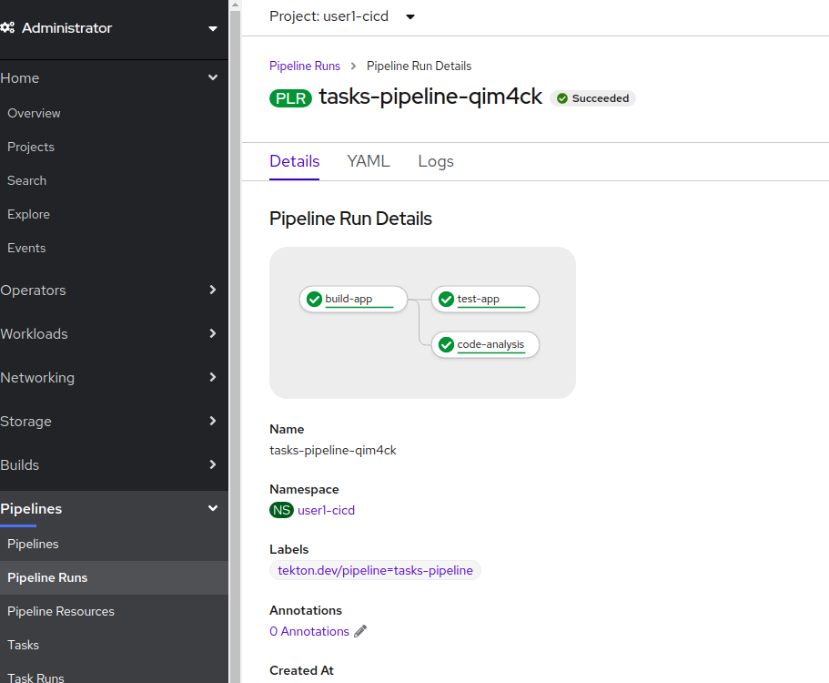
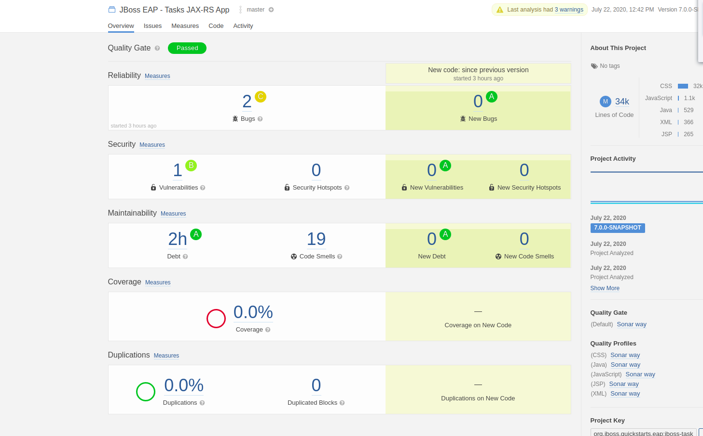

# Introduction

In this section, we will add the "Code Analysis" stage into the pipeline



# Static Application Security Testing

We will leverage the Maven Sonar plugin to run SonarQube scanning against our source code.

SonarQube is an open source static code analysis tool that we can use to automate running security scans against your source code to further improve the security of your application.  Every time you check-in code, SonarQube will scan the quality and perform a threat analysis of that code.

We leverage the sonarqube maven plugin and specify the maven goal "sonar:sonar" to run our project leveraging the sonarqube api.

SonarQube's security rules originate from these standards:

* [CWE Database][1] - Common Weakness Enumeration (CWE™) is a formal list or dictionary of common software weaknesses that can occur in software's architecture, design, code or implementation that can lead to exploitable security vulnerabilities.

* [SANS Top 25][2] - The SANS Top 25 list is a collection of the 25-most dangerous errors listed in the CWE, as compiled by the SANS organization.

* [OWASP Top 10][3] - The OWASP Top 10 is a list of broad categories of weaknesses, each of which can map to many individual rules.

# Add Pipeline steps for Code Analysis

With the information above, we can again add an extra step to the pipeline and reuse our `simple-maven` task. A few curious and powerful thing to note : 
* Since we want the Code Analysis to run in parallel with the Unit Tests, we can ask Tekton to run this `code-analysis` task *after* the build, and that will make the `test-app` and `code-analysis` run in parallel. It's *that* easy !!! 
* We will use the OpenShift service name for SonarQube so that the build can access the running SonarQube instance (in the devsecops project)

```yaml
apiVersion: tekton.dev/v1beta1
kind: Pipeline
metadata:
  name: tasks-pipeline
spec:
  resources:
    - name: tasks-source-code
      type: git

  workspaces:
    - name: local-maven-repo

  tasks:
    - name: build-app
      # ... snipped for brevity ... 
    - name: test-app
      # ... snipped for brevity .. 
    - name: code-analysis
      taskRef:
        kind: Task
        name: simple-maven
      params:
          - name: GOALS
            value: 
            - compile
            - sonar:sonar
            - '-Dsonar.host.url=http://sonarqube.devsecops.svc.cluster.local:9000'
            - '-DskipTests=true' 
          - name: SETTINGS_PATH
            value: configuration/cicd-settings-nexus3.xml
          - name: POM_PATH
            value: pom.xml
      resources:
        inputs:
          - name: source
            resource: tasks-source-code
      workspaces:
        - name: maven-repo
          workspace: local-maven-repo
      runAfter:
          - build-app
```
# Test Your Pipeline

```bash
tkn pipeline start --resource tasks-source-code=tasks-source --workspace name=local-maven-repo,claimName=maven-repo-pvc tasks-pipeline --showlog

```



# SonarQube Dashboard

Once we build the full pipeline and run it, we will log into SonarQube and view the various metrics, stats, and code coverage as seen from the screenshot below.

To get the URL of the SonarQube dashboard, run the command:
```bash
oc get route sonarqube -n devsecops
NAME        HOST/PORT                                                                    PATH   SERVICES    PORT    TERMINATION     WILDCARD
sonarqube   sonarqube-devsecops.apps.cluster-nisky-0450.nisky-0450.example.opentlc.com          sonarqube   <all>   edge/Redirect   None

```

Paste the URL in your browser and log in with your workshop credentials. 




# Conclusion

In this lab we continued adding steps to our pipeline by using our existing `simple-maven` task, and leaning on the capabilities of an existing product like SonarQube to extract valuable information about the quality of the code that is about to be deployed


[1]: http://cwe.mitre.org/about/index.html
[2]: https://www.sans.org/top25-software-errors/
[3]: https://www.owasp.org/index.php/Top_10-2017_Top_10

