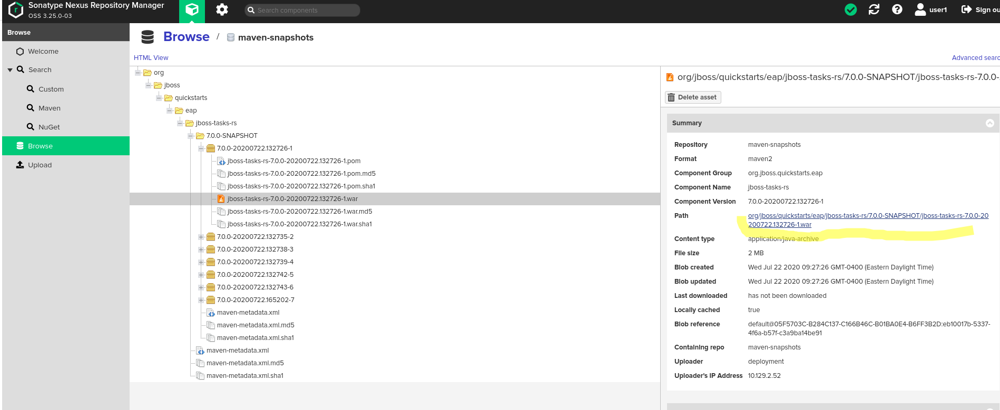
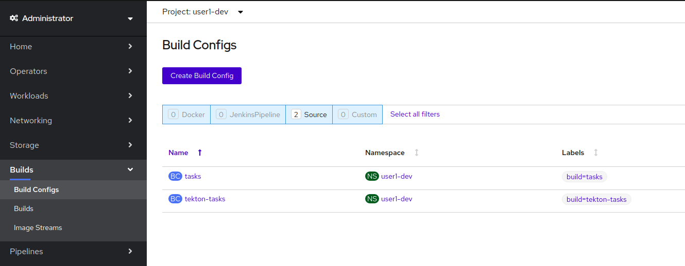
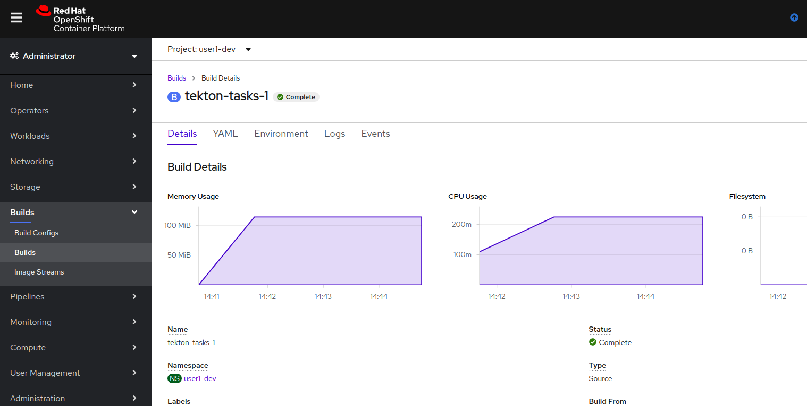

# Introduction

In this lab we will add the "Image Builder" and "Build Container Image"  stages in your pipeline


# OpenShift, Containers, and Container Images

Containers are an important foundation for your application in building a Trusted Software Supply Chain.  You want a secure and blessed golden container image that your application will inherit security controls from.

Containers are built using a layered approach. For example, to create a container of a Java web application, you could do so in multiple layers: the OS, the JVM, the web server, and the code itself.


We can incorporate CVE and vulnerability scanning against images in an automated fashion.  Any image change is scanned to improve the inherited security of your application.  We have partners such as Black Duck and Twistlock that do container image scanning.  Also, as a result of Red Hat's acquisition of CoreOS, we now offer Quay as an enterprise-grade registry that does vulnerability scanning.

We can also cryptographically sign your image so you know your container is running with a verified container image.

## Start with Quality Parts

Red Hat has a container registry that provides certified Red Hat and third-party container images that will be the foundation of your container images.  Our Registry also has a health index of the image so you know the state of the image.


## OpenShift Container Images and Tools 
In the last few stages, because goal could be accomplished by invoking a Maven goal, we were able to use the `simple-maven` task that we built in the earlier steps. At this point, however, we will need to work a lot more closely with OpenShift as a platform. Although there are some Maven plugins that allow Maven to interact with OpenShift, this is a place where it makes sense to use OpenShift's own capabilities through the `oc` CLI. 

As we discussed before, we want to have a feedback loop that is as tight as possible so that we can experiment with and learn as quickly as possible. 

There are a few different ways we can go about in creating a container image for the application. One way would be to build our own from scatch using a Dockerfile, e.g.
* Start from a secure base image
* Add the JVM and JBoss EAP runtime binaries
* Add the Tasks apps binaries where the EAP runtime expects them to be
* Build the container image on the local machine and push it to a container registry that is accessible to OpenShift

Because this is such a common need for container applications, OpenShift provides a set of building blocks that make the process much easier. The OpenShift builds system is beyond the scope of what we can cover in a workshop, but in short here are the essentials. 

An OpenShift binary BuildConfig encapsulates all four steps above:
* We can specify the `builder-image` that would perform the steps above- in this case, it is `jboss-eap72-openshift:1.1` which is available in OpenShift's internal registry. Similar Builder images exist for other common software components - e.g. be it a nodejs application, a plan java app (with a runnable jar), or a python app built using django
* Once this binary build is created, we can stream the contents of the WAR we want to deploy into it
* The BuildConfig will use the builder image to produce a new image that contains the runtime of a hardened, secured, and up-to-date image of the JBoss EAP runtime with the Tasks WAR deployed in it
* The BuildConfig will push the newly created image into the internal repository which we can then use to deploy 

## openshift-client ClusterTask
Similarly to our experimentation stage in [Lab 06](lab06.md), we first need to find a pre-existing Task (such as a ClusterTask), or a container image that has the `oc` CLI. 

Looking at the Task Catalog, we can see that there is an existing `openshift-client` ClusterTask


Let's investigate that ClusterTask, it might just do the job.
```bash
tkn  clustertask describe openshift-client
Name:   openshift-client

📨 Input Resources

 NAME       TYPE
 ∙ source   git

📡 Output Resources

 No output resources

⚓ Params

 NAME       TYPE     DESCRIPTION              DEFAULT VALUE
 ∙ SCRIPT   string   The OpenShift CLI a...   oc $@
 ∙ ARGS     array    The OpenShift CLI a...   [help]

🦶 Steps

 ∙ oc

```
This ClusterTask comes in very handy if we need to implement a stage that just needs to send a command or two to OpenShift using the `oc` CLI. Alternatively, we could use the same container image as the ClusterTask if we need more complicated structure or behavior for the stage.  

# Implement "Create Image" stage in pipeline 

## Experiment and validate 
Let's go through those steps to work through the mechanics of how this works:
1. Download the Tasks WAR file from Nexus:
Navigate to Nexus, login with your credentials, and browse the `maven-snapshots` repository, navigate into the org/jboss/quickstarts/jboss-tasks-rs/7.0.0-SNAPSHOT artifact and click the "Path" link (from the right panel) to download the WAR file. 



2. For simplicity purposes, create a separate directory (e.g. `oc-build`), and copy the downloaded war file into that folder

3. Create a new binary build in your OpenShift user's Dev project :

4. Start the OpenShift build and wait for it to complete

Here are the steps that I performed 
```bash
$ mkdir ./oc-build && cp <your-downloads-folder>/jboss-tasks-rs-7.0.0*.war ./oc-build/

$ oc new-build --name=tekton-tasks --image-stream jboss-eap72-openshift:1.1  --binary=true -n <user#>-dev
--> Found image 0ca7413 (10 months old) in image stream "openshift/jboss-eap72-openshift" under tag "1.1" for "jboss-eap72-openshift:1.1"

    JBoss EAP 7.2 
    ------------- 
    Platform for building and running JavaEE applications on JBoss EAP 7.2

    Tags: builder, javaee, eap, eap7

    * A source build using binary input will be created
      * The resulting image will be pushed to image stream tag "tekton-tasks:latest"
      * A binary build was created, use 'oc start-build --from-dir' to trigger a new build

--> Creating resources with label build=tekton-tasks ...
    imagestream.image.openshift.io "tekton-tasks" created
    buildconfig.build.openshift.io "tekton-tasks" created
--> Success


$oc start-build tekton-tasks --from-dir=./oc-build/ -n <user#>-dev --wait=true
oc start-build tekton-tasks --from-dir=./oc-build/ -n user1-dev --wait=true
Uploading directory "oc-build" as binary input for the build ...

Uploading finished
build.build.openshift.io/tekton-tasks-1 started

```

With these three steps, you should be able to see in the OpenShift Console:
* A new `tekton-tasks` Build Config 

* A new `tekton-tasks-*` build run and complete successfully

* A new `tekton-tasks` image stream (which is an OpenShift construct similar to a container image but with a few more capabilities), together with the location in the image registry where that image can be pulled from 


## Create a Task to create the container image

Now that we know the exact commands that we need in our Pipeline, let's add an extra task to make that happen. Because we want to be able to experiment with this Task until we get it right, we will put the commands in a separate Task and run it until we get it right ( and we will parametrize the task out of the box so that we can easily work with it from the pipeline). 

A few things to note:
* The task uses the `quay.io/openshift/origin-cli:latest` container image to execute the commands. If we only had to run a command-or-two for this stage, we could have used the existing ClusterTask, but because we also have to do some checking and clean-up (to make the task run repeatable), we will just lean on the same container image that the ClusterTask uses
* The `set -e -o pipefail` makes the step fail if any of the commands fail in running (so that we don't have to check exit codes for each command)
* Since we have access to the local Maven repo in the `maven-repo` workspace, we will use the artifact that the prior steps in the pipeline put there. In a production setup, this artifact would likely be retrieved from the Nexus artifact repository 
* Using our own Task for this stage will also allow us to extend the task as we need to if there are future changes that are required without changing the actual pipeline
  
```yaml
 apiVersion: tekton.dev/v1beta1
  kind: Task
  metadata:
    name: create-jboss-app-image
  spec:
    params:
      - default: tasks
        description: The name of the app
        name: app_name
        type: string
      - description: The name dev project
        name: dev_project
        type: string
      - description: binary artifact path in the local artifact repo
        # something like org/jboss/quickstarts/eap/jboss-tasks-rs/7.0.0-SNAPSHOT/jboss-tasks-rs-7.0.0-SNAPSHOT.war
        type: string
        name: artifact_path
    resources:
      inputs:
        - name: source
          type: git
    steps:
      - name: create-build-config
        image: 'quay.io/openshift/origin-cli:latest'
        script: >
          #!/bin/sh

          set -e -o pipefail

          echo "Creating new build config"  

          # This allows the new build to be created whether it exists or not

          oc new-build -o yaml --name=$(params.app_name) --image-stream=jboss-eap72-openshift:1.1  --binary=true -n
          $(params.dev_project) | oc apply -n $(params.dev_project) -f - 
      - name: build-app-image
        image: 'quay.io/openshift/origin-cli:latest'    
        script: >
          #!/bin/sh

          set -e -o pipefail

          echo "Start the openshift build"  


          rm -rf $(inputs.resources.source.path)/oc-build && mkdir -p $(inputs.resources.source.path)/oc-build/deployments 


          cp $(workspaces.maven-repo.path)/$(params.artifact_path) $(inputs.resources.source.path)/oc-build/deployments/ROOT.war 


          oc start-build $(params.app_name) --from-dir=$(inputs.resources.source.path)/oc-build -n   $(params.dev_project) --wait=true 


    workspaces:
      - name: maven-repo
```

Now, let's clean up the resources that we created manually and try running the task:
```bash
$oc delete buildconfig tekton-tasks -n <user#>-dev
$oc delete imagestream tekton-tasks -n <user#>-dev
```

Let's start the task and see it re-create the same resources (be sure to replace <user#> with your username):
```bash
tkn task start --inputresource source=tasks-source --param app_name=tekton-tasks  --param dev_project=<user#>-dev --param artifact_path 'org/jboss/quickstarts/eap/jboss-tasks-rs/7.0.0-SNAPSHOT/jboss-tasks-rs-7.0.0-SNAPSHOT.war' --workspace name=maven-repo,claimName=maven-repo-pvc create-jboss-app-image --showlog

```

We should observe the same BuildConfig and ImageStream artifacts being created in the <user#>-dev project as when we created them manually. 

## Add the task to create container image to the pipeline

With all this done, we can update the pipeline to run after the archive task  (be sure to replace the <user#> token in the yaml below)
```yaml
apiVersion: tekton.dev/v1beta1
kind: Pipeline
metadata:
  name: tasks-pipeline
spec:
  resources:
    - name: tasks-source-code
      type: git

  workspaces:
    - name: local-maven-repo

  tasks:
    - name: build-app
      # ... snipped for brevity ... 
    - name: test-app
      # ... snipped for brevity .. 
    - name: code-analysis
      # ... snipped for brevity
    - name: archive
      # ... snipped for brevity
    - name: create-image
      taskRef:
        kind: Task
        name: create-jboss-app-image
      params:
          - name: app_name
            value: tekton-tasks
          - name: dev_project
            value: <user#>-dev
          - name: artifact_path
            value: 'org/jboss/quickstarts/eap/jboss-tasks-rs/7.0.0-SNAPSHOT/jboss-tasks-rs-7.0.0-SNAPSHOT.war'
      resources:
        inputs:
          - name: source
            resource: tasks-source-code
      workspaces:
        - name: maven-repo
          workspace: local-maven-repo
      runAfter:
          - archive

```

With that in place, re-start the last Pipeline run from the Web Console and observe the completion of the pipeline. The expected artifacts are again found in the <user#>-dev project (BuildConfig, ImageStream, etc)


# Conclusion

In this lab we extended the pipeline by creating a container image from our Tasks application. The image we created is based on a secure base image, with a minimal set of bits of JBoss EAP included - only what's needed to run our application. 

