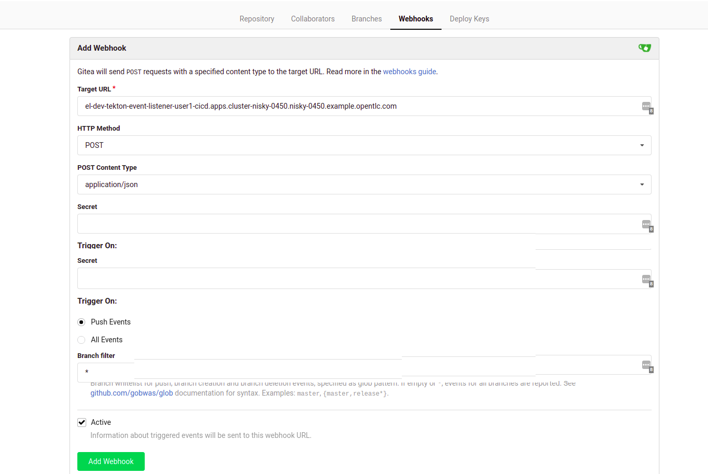
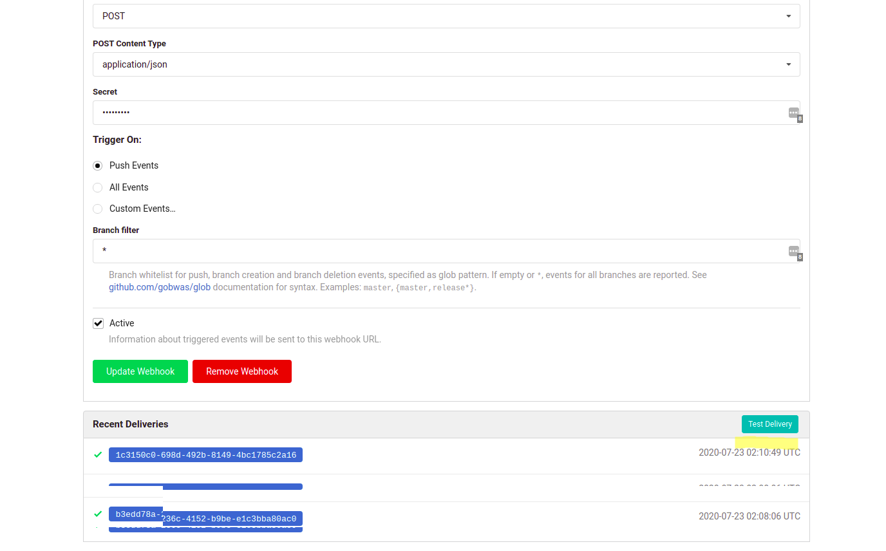
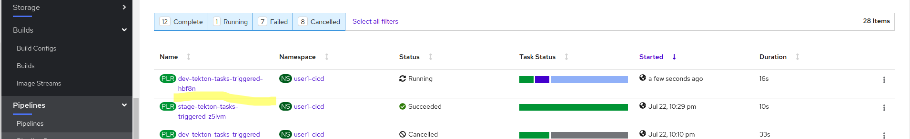

# Introduction

In this lab, we will explore approaches to triggering the Trusted Software Supply chain with code check-ins

# Tekton Triggers Introduction

At first glance (if you start reading the [Tekton Triggers Documentation](https://github.com/tektoncd/triggers/tree/master/docs)) it does sounds a bit complicated as the approach is very flexible and has many options. 

However, if we want to create a simple webhook, at the simplest level we need the following: 
* Something that has a template to create the Tekton objects we want. In our case, we would want the webhook to kick off our pipelines, so we will need a template for a PipelineRun (based on our prior executions of our pipelines). In the land of Tekton, the `TriggerTemplate` provides that capability, together with some parametrization abilities
* When a request comes in, we need something to extract the data from the incoming request (headers, body, etc) and map it to the parameters of our `TriggerTemplate`
* Something to listen to a URL/route that is accessible to the system that will trigger the webhook. For that, we will use an `EventListener`, which combines the maps the `TriggerBinding` and `TriggerTemplate` for each event that we want to handle. Once Tekton stands up the pod and the service, we will expose the route using the `oc` CLI. 

# Dev Pipeline Webhook

The goal of setting this up is to trigger a new pipeline run of our `tekton-tasks` pipeline every time someone commits to our Gitea repository. While this can be made quite much more customizable and extensible, we will start with the simplest thing possible. 

## Configure Tekton triggers objects
* First, create a TriggerTemplate. If you inspect the prior runs of the `tasks-pipeline`, the PipelineRuns that we created were pretty simple. They didn't use any parameters, so that makes the PipelineRun template below as simple as it can be. Switch to the `<user#>-cicd` project and add the YAML below. 


```yaml
apiVersion: triggers.tekton.dev/v1alpha1
kind: TriggerTemplate
metadata:
  name: dev-tekton-tasks-trigger-template
spec:
  resourcetemplates:
  - apiVersion: tekton.dev/v1beta1
    kind: PipelineRun
    metadata:
      generateName: dev-tekton-tasks-triggered-
    spec:
      pipelineRef:
        name: tasks-pipeline
      resources:
      - name: tasks-source-code
        resourceRef:
          name: tasks-source
      serviceAccountName: pipeline
      workspaces:
      - name: local-maven-repo
        persistentVolumeClaim:
          claimName: maven-repo-pvc

```

* Then, we need a trigger binding. Again, because we're not mapping any parameters from the incoming request, this is basically an empty object. Create the YAML object below in the `<user#>-cicd` project

```yaml
apiVersion: triggers.tekton.dev/v1alpha1
kind: TriggerBinding
metadata:
  name: dev-tekton-tasks-trigger-binding
spec: {}
```
* We will create the `EventListener` below. As soon as this is created, Tekton creates a service named `el-<event-listener-name>` and a related pod to serve requests to this service. For the `dev-tekton-event-listener` below, the service will be named `el-dev-tekton-event-listener`. Note that we are using a trivial secret check using an interceptor to only allow incoming requests with the provided value to trigger our pipeline
  
```yaml
apiVersion: triggers.tekton.dev/v1alpha1
kind: EventListener
metadata:
  name: dev-tekton-event-listener
spec:
  serviceAccountName: pipeline
  triggers:
    - name: gitea-event
      bindings:
        - name: dev-tekton-tasks-trigger-binding
      interceptors:
        - cel:
            filter: body.secret == "secret1234"
      template:
        name: dev-tekton-tasks-trigger-template
```
In order to make this service available externally to the cluster, we will expose the service (please replace the <user#> token with your username): 
```bash
$ oc expose svc el-dev-tekton-event-listener -n <user#>-cicd
```

## Add a Webhook definition in Gitea

The last step is to configure Gitea to invoke this webhook

* In the `devsecops` project, find the route of the `gitea-server`, e.g. 
```bash
$ oc get route gitea-server -n devsecops
NAME           HOST/PORT                                                                       PATH   SERVICES       PORT    TERMINATION     WILDCARD
gitea-server   gitea-server-devsecops.apps.cluster-nisky-0450.nisky-0450.example.opentlc.com          gitea-server   <all>   edge/Redirect   None

```

* Navigate to `Gitea` and log in using your <user#> username. Click on your `openshift-tasks` repository, navigate to the `Settings` page, and on that page click on the `Webhooks` tab. 


Use `oc` to extract the URL of the new route that we created for the Tekton EventListener:
```bash
$ oc get route el-dev-tekton-event-listener 
NAME                           HOST/PORT                                                                                        PATH   SERVICES                       PORT            TERMINATION   WILDCARD
el-dev-tekton-event-listener   el-dev-tekton-event-listener-user1-cicd.apps.cluster-nisky-0450.nisky-0450.example.opentlc.com          el-dev-tekton-event-listener   http-listener                 None
```
* Click on the `Add Webhook` button and choose `Gitea` as the webhook type. On the resulting page, fill in the `el-dev-tekton-event-listener` route URL in the `Target URL` field and `secret1234` in the `Secret` field - everything else can stay as default. Click the `Add Webhook` button to save.  



You will be redirected to the `Webhooks` screen, click on the webhook that you just created, and scroll to the bottom. Now, when you click on the `Test Delivery` button, you will see your Pipeline triggered (note that the name matched what you specified in the `TriggerTemplate`)





* Finally, test the delivery by making a test commit in the Gitea web UI. Navigate to the root of the `openshift-tasks` app and edit the `README` by clicking on the pencil icon, and adding a blank line and committing the change. Immediately, you will see the `tekton-task` pipeline being triggered again. 

# Add a Webhook for the stage pipeline. 

The process to creating the webhook to trigger the Stage pipeline is very similar. However, we will simply use `curl` to trigger the pipeline and pass in the required parameters. Create the Tekton objects below, here are a few notable items:
* The `TriggerTemplate` actually takes a parameter and uses the value of the parameter (using the `$(params.app_ver)` parameter substitution) to pass that value to the PipelineRun template. Remember - our Stage pipeline requires the user to provide the `app_version` parameter. 
* The `TriggerBinding` extracts the `app_ver` parameter from the body of the incoming request using the `$(body.app_ver)` syntax to extract a value from a JSON body.  

```yaml
apiVersion: triggers.tekton.dev/v1alpha1
kind: TriggerTemplate
metadata:
  name: stage-tekton-tasks-trigger-template
spec:
  params:
  - name: app_ver
    description: App version / gitsha to deploy
  resourcetemplates:
  - apiVersion: tekton.dev/v1beta1
    kind: PipelineRun
    metadata:
      generateName: stage-tekton-tasks-triggered-
    spec:
      pipelineRef:
        name: stage-tekton-tasks
      serviceAccountName: pipeline
      params:
      - name: app_version
        value: $(params.app_ver)

```

```yaml
apiVersion: triggers.tekton.dev/v1alpha1
kind: TriggerBinding
metadata:
  name: stage-tekton-tasks-trigger-binding
spec: 
  params: 
  - name: app_ver
    value: $(body.app_ver)
```


```yaml
apiVersion: triggers.tekton.dev/v1alpha1
kind: EventListener
metadata:
  name: stage-tekton-event-listener
spec:
  serviceAccountName: pipeline
  triggers:
    - name: curl-event
      bindings:
        - name: stage-tekton-tasks-trigger-binding
      interceptors:
        - cel:
            filter: body.secret == "secret1234"
      template:
        name: stage-tekton-tasks-trigger-template
```
* Test the newly created Webhook
  
After creating these objects, create the `Route` for the `el-stage-tekton-event-listener` service. 
```bash
$ oc expose service el-stage-tekton-event-listener
```

Get the URL for the newly exposed Route
```bash
$ oc get route el-stage-tekton-event-listener 
```

In order to simulate that a new app version was created, we will simply tag the `tekton-tasks` image stream with a new value that we will then use as our `app_ver` parameter, as the Dev pipeline would do exactly the same using the gitsha of the latest commit (please replace the <user#> token with your username):
```bash
$ oc tag tekton-tasks:latest tekton-tasks:foobar1 -n <user#>-dev
```

Now, trigger the webhook passing `foobar1` as the `app_ver` parameter and observe that the `stage-tekton-tasks` pipeline is running. Note that if you don't include the `secret` value in the body or include a different value, the webhook will not trigger the pipeline. 
```bash
$curl -X POST -d '{"app_ver":"foobar1", "secret":"secret1234"}' http://el-stage-tekton-event-listener-user1-cicd.apps.cluster-nisky-0450.nisky-0450.example.opentlc.com/
```


# Conclusion

In this lab we went over the simplest possible setup to allow the triggering and integration of our pipelines with external tools using Webhooks. For the Dev pipeline, it will be triggered on each commit in our Gitea repository. For the Stage pipeline, we expose a webhook that can be invoked with a parameter - possibly from a custom tool that processes the approval of promotions between stages. 

Note that the examples above are probably the simplest one possible, and uses a trivial security mechanism to validate the incoming requests that trigger the pipelines. 


