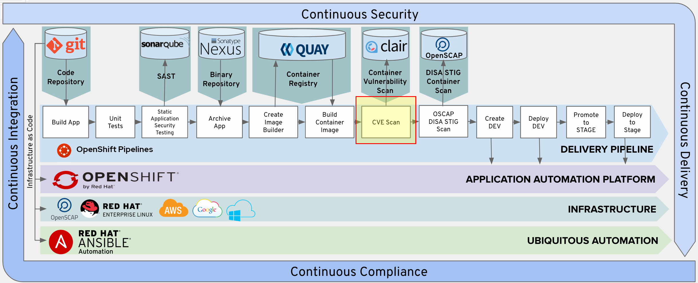
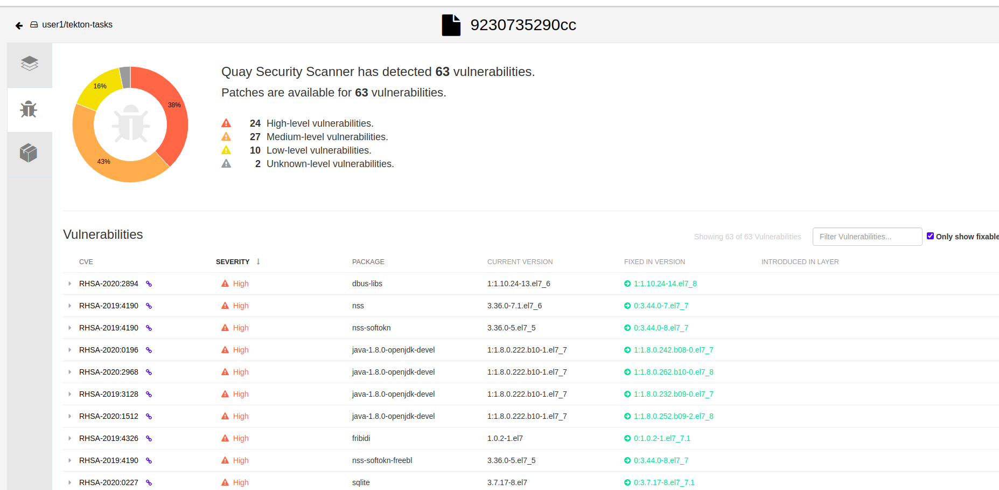
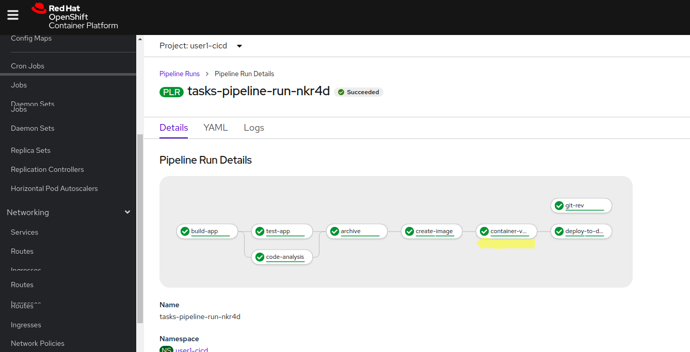
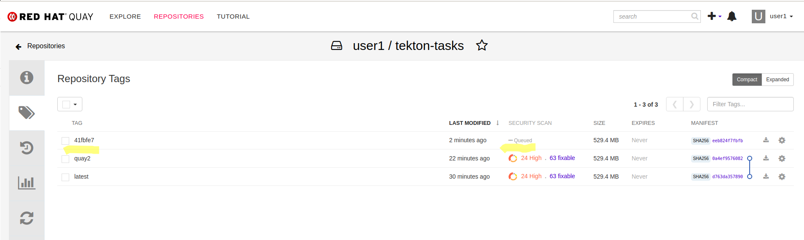

# Introduction

In this lab we will add Container Vulnerability Scanning through Clair



# Explore Quay
The workshop environment includes an instance of Red Hat Quay container registry.  In a browser, open the following URL `quay.apps.<ocp-cluster>` (replace <ocp-cluster> token with the base URL of your OpenShift cluster - e.g. `cluster-nisky-0450.nisky-0450.example.opentlc.com`) and log in with your username. 


Click on the `Create New Repository` button, name it `tekton-tasks` and choose it to be a private repository. 


Now that we have a new repository, we can push and pull images from this repository.  

(remember to replace the <user#> token with your username)
```bash

$ oc tag tekton-tasks:latest tekton-tasks:quay1 -n <user#>-dev

$ podman run -it --entrypoint /bin/bash quay.io/skopeo/stable

$ skopeo login default-route-openshift-image-registry.apps.cluster-nisky-0450.nisky-0450.example.opentlc.com/<user#>-dev/tekton-tasks

$ skopeo login https://quay.apps.cluster-nisky-0450.nisky-0450.example.opentlc.com/repository/<user#>/tekton-tasks --tls-verify=false

$ skopeo  copy docker://default-route-openshift-image-registry.apps.cluster-nisky-0450.nisky-0450.example.opentlc.com/<user#>-dev/tekton-tasks:latest docker://quay.apps.cluster-nisky-0450.nisky-0450.example.opentlc.com/<user#>/tekton-tasks:quay1 --src-tls-verify=false --dest-tls-verify=false

```

Now, if we navigate to the Quay repository for `tekton-tasks` we can see the vulnerabilities that have been found in the image. 




# Create Push-to-Quay task

Now that we have a way to push images into Quay using `skopeo`, let's explore how to bundle that into a Tekton Task.  As before, the easiest path forward is to create a standalone TaskRun with the TaskSpec bundled in it in order to work out the details of the task. Notable details below: 
* The container image for Skopeo is `quay.io/skopeo/stable`
* Instead of using the Route for the internal registry, we use the internal service URL - `image-registry.openshift-image-registry.svc.cluster.local:5000`
* Instead of using the Quay route, we use the internally accessible service at `quayecosystem-quay.quay-enterprise.svc.cluster.local:443`
* We can omit the step of logging into the internal and quay registries, because the `pipeline` service account already has secrets it needs to access the registries attached to it (which were created as a part of the cluster setup for the workshop). Note that if that were not the case, skopeo supports multiple options for providing credentials for the source and destination registries (e.g `--src-creds` and `--dest-creds` options)
* We include the `--debug` flag to show additional details in case the operation is failing

(remember to replace the <user#> token with your username)

```yaml
apiVersion: tekton.dev/v1beta1
kind: TaskRun
metadata:
  generateName: skopeo-quay-copy-
spec:
  taskSpec:
    steps:
    - name: skopeo-copy
      args:
        - copy 
        - --debug
        - docker://image-registry.openshift-image-registry.svc.cluster.local:5000/<user#>-dev/tekton-tasks:latest  
        - docker://quayecosystem-quay.quay-enterprise.svc.cluster.local:443/<user#>/tekton-tasks:quay
        - --src-tls-verify=false 
        - --dest-tls-verify=false
      command:
        - /usr/bin/skopeo
      image: quay.io/skopeo/stable
```

Once we see this TaskRun completing successfully, we can migrate the Task spec to a standalone task and parametrize it as needed. Below are the resources at hand. A few notable items:
* We could create explicit PipelineResources for the source and target images (in quay and the internal registry); however, we would need to create a new one for each Revision, which doesn't make a lot of sense.  


```yaml
  apiVersion: tekton.dev/v1beta1
  kind: Task
  metadata:
    name: send-to-quay
  spec:
    params:
    - description: >-
        Source (project/image:tagName) and image:rev to push, e.g.
        user1-dev/tekton-tasks:latest
      name: source_image
      type: string
    - description: >-
        The target (user/repo:tagName) where to push in quay, e.g.
        user1/tekton-tasks:quay1
      name: target_image
      type: string

    steps:
    - name: skopeo-copy
      args:
        - copy 
        - docker://image-registry.openshift-image-registry.svc.cluster.local:5000/$(params.source_image
        - docker://quayecosystem-quay.quay-enterprise.svc.cluster.local:443/$(params.target_image)
        - --src-tls-verify=false 
        - --dest-tls-verify=false
      command:
        - /usr/bin/skopeo
      image: quay.io/skopeo/stable
```

With this Task, we can now test the task run:
```bash
tkn task start --param source_image=user1-dev/tekton-tasks:latest --param target_image=user1/tekton-tasks:quay2 send-to-quay --showlog

```

We can see the TasRun succeed - we're in business ! 


# Add Clair Container Scan to Pipeline

We can now update our Pipeline to include the `Clair Container Vulnerability Scan` step, right after the "Build Image" stage. 

```yaml
apiVersion: tekton.dev/v1beta1
kind: Pipeline
metadata:
  name: tasks-pipeline
spec:
  resources:
    - name: tasks-source-code
      type: git

  workspaces:
    - name: local-maven-repo

  tasks:
    - name: build-app
      # ... snipped for brevity ... 
    - name: test-app
      # ... snipped for brevity .. 
    - name: code-analysis
      # ... snipped for brevity
    - name: archive
      # ... snipped for brevity
    - name: create-image
      # ... snipped for brevity
    - name: container-vulnerability-scan
      taskRef:
        kind: Task
        name: send-to-quay
      params:
          - name: source_image
            value: <user#>-dev/tekton-tasks:$(tasks.git-rev.results.gitsha)
          - name: target_image
            value: <user#>/tekton-tasks:$(tasks.git-rev.results.gitsha)
      runAfter:
          - create-image  
    - name: deploy-to-dev
      taskRef:
        # ... snipped for brevity
      runAfter:
          - container-vulnerability-scan
```

We can re-start the `tekton-tasks` pipeline and see it go through completion: 
```bash
tkn pipeline start --resource tasks-source-code=tasks-source --workspace name=local-maven-repo,claimName=maven-repo-pvc tasks-pipeline --showlog
```



If we navigate to Quay, we can also see the newly added tag (based on the gitrev) created in Quay


# Conclusion

In this lab we explored the features of Quay and it's ability to run Container Vulnerability scans on images pushed into Quay. Then, we enhanced our pipeline to include a step to push our created image into Quay so that we can inspect the vulnerabilities in it, before a decision is made whether to send the application to the Stage environment