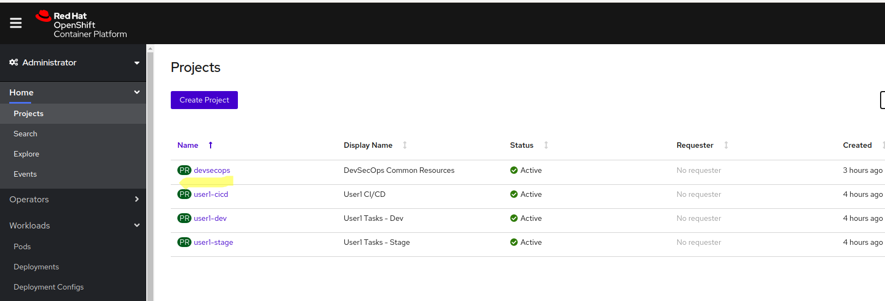
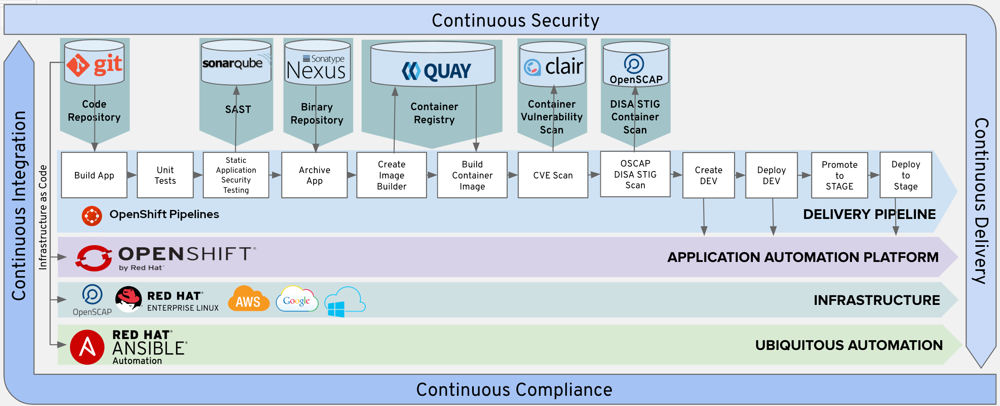

Before moving forward, it is important to understand the difference between [Continuous Integration (CI), Continuous Delivery (CD), and Continuous Deployment][1].

Also, a part of this lab we’ll be using using [OpenShift Pipelines][2] for CI/CD, which gives you control over building, deploying, and promoting your applications on OpenShift. Using a combination of the Jenkins Pipeline Build Strategy, Jenkinsfiles, and the OpenShift Domain Specific Language (DSL) (provided by the OpenShift Jenkins Client Plug-in), you can create advanced build, test, deploy, and promote pipelines for any scenario.

OK, let’s go ahead and start building an OpenShift CI/CD Pipeline using In the OpenShift Console.

First, click on the [user#]-devsecops project from the list of projects

 

You will see the project dashboard which shows the "common infrastructure" for our Secure Software delivery pipeline. If you navigate to the "Deployments" section, you will see deployments (and some additional supporting deployments such as databases) for each of the following software components: 

- codeready - CodeReady Workspaces is a browser-based development environment based on Eclipse Che
- gitea-server - Gitea is an open source git server written in Go.
- nexus - Nexus is a popular artifact repository manager used for storing and retrieving binary artifacts such as jars, npms, etc. 
- sonarqube - SonarQube is an open source static code analysis tool

 

You may ask : how am I going to build a CI/CD pipeline if I don't have a tool like Jenkins for building CI/CD pipelines ? 
I will answer : just kick back and get ready for a ride with OpenShift Pipelines

 

# The Flow of the Trusted Software Supply Chain

OpenShift Pipelines is the CI/CD tool (based on the upstream Tekton project) that will execute the project. 

Below are the main steps of the "Dev" stage of the pipeline: 

- Clone the git repository and make it available to the rest of the pipeline tasks. 
- Compile and packages the code using Maven
- Execute the JUnit Test that exist in the same source tree. 
- Analyze the source code is analyzed for vulnerabilities, bugs, and bad patterns using SonarQube
- Package the application as a WAR file, then pushes the WAR artifact to the Nexus Repository manager
- Creates a container image based the JBoss EAP runtime image and the content of the WAR artifact that was pushed to Nexus, and tag the newly created container image with the git SHA of the revision that was built
- Deploys the newly created container image into the <user#>-dev project

At this point, the first part of the pipeline stops to allow for the opportunity to test the application that is deployed. The verification of the deployed application can involve many different aspects : manual verification, execution of some integration tests against the running system, etc. 

When the verification is complete, the "Stage" part of the pipeline will perform the following steps:
- Tag the container created in the "Dev" stage of the pipeline and make it available in the <user#>-stage project
- Clean up the artifacts from the previous version of the application
- Deploy a new version of the application based on the newly tagged image into the <user#>-stage project

 
 

[1]: https://stackoverflow.com/questions/28608015/continuous-integration-vs-continuous-delivery-vs-continuous-deployment
[2]: https://docs.openshift.com/container-platform/4.4/pipelines/understanding-openshift-pipelines.html

