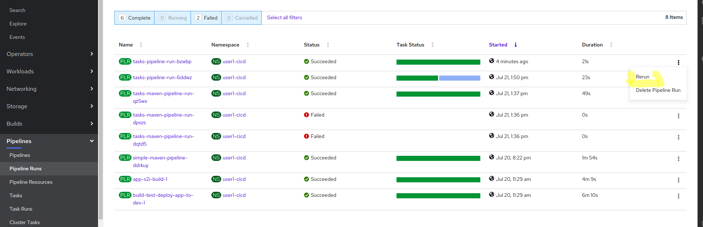

# Introduction  

In this lab, we will add the `Test` stage of the DevSecOps pipeline

# Add New Task to the Pipeline 

Since the tests in a maven project are run directly by Maven, all we need is to add a new task to our pipeline that will call the `test` goal. We can reuse our existing `simple-maven` task and pass a parameter for the `GOAL` param in the task.

The only thing that is different about the `test-app` task in the pipeline is that we are using the `runAfter` attribute so that the `test-app` task runs in *after* `build-app` instead of in parallel (this will come in handy very shortly)


```yaml
apiVersion: tekton.dev/v1beta1
kind: Pipeline
metadata:
  name: tasks-pipeline
spec:
  resources:
    - name: tasks-source-code
      type: git

  workspaces:
    - name: local-maven-repo

  tasks:
    - name: build-app
      # ... snipped for brevity ... 
    - name: test-app
      taskRef:
        kind: Task
        name: simple-maven
      params:
          - name: GOALS
            value: 
            - test 
          - name: SETTINGS_PATH
            value: configuration/cicd-settings-nexus3.xml
          - name: POM_PATH
            value: pom.xml
      resources:
        inputs:
          - name: source
            resource: tasks-source-code
      workspaces:
        - name: maven-repo
          workspace: local-maven-repo
      runAfter:
          - build-app

```

# Run the Pipeline
OK - so, the pipeline is a little verbose, but beyond a few of the repeated configuration parameters (e.g. like SETTINGS_PATH, resources, etc), we're just leaning the hard work that we did in the previous lab. 
```bash
tkn pipeline start --resource tasks-source-code=tasks-source --workspace name=local-maven-repo,claimName=maven-repo-pvc tasks-pipeline --showlog

```


Alternatively, since we're not passing any new parameters to the pipeline, we can just re-run the previous pipeline run. 



In the Pipeline Run details screen, we can now see the two tasks in the pipeline executing one after another. 


# Conclusion

In this stage we just ended up reusing our work in building a reusable task and we were able to very quickly add a new Task in the pipeline