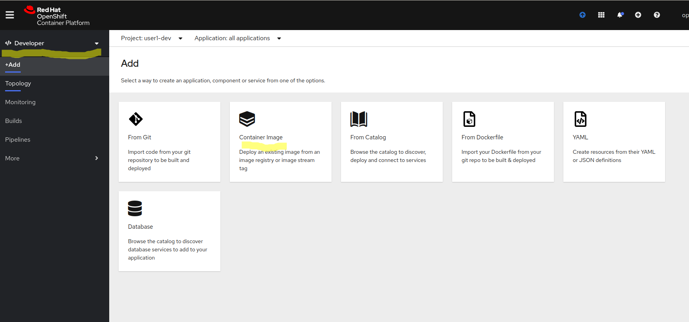

# Introduction

In this lab we will implement the "Create Dev" and "Deploy to Dev" stages


# Deploy to Dev

This is where the rubber meets the road - so far, we've done all the steps in our pipeline that build, test, analyze, archive, and create a container image for our application. If all of these stages complete, we should be ready to run this application in our Dev project. 

In the bigger scheme of things, so far, our application has passed the first few steps in the organization's process of validating that it is ready to be run. At this point, we feel comfortable enough in putting in a full Dev environment (outside the individual developers' worksations) where we can see it in action. Once it's deployed there, some additional tests could be run - maybe some end-to-end smoke tests to make sure that the application indeed functions as expected. 

## Manual Deploy
The easiest way to deploy an application is using the Developer Console in OpenShift. Now that we have the application image in the internal registry, the deployment process is a snap ! 

* Switch to the Developer console (from the upper-left corner navigation) and click the "+Add" button and choose the "Container Image" tile


* Choose the "Image Stream tag from internal registry" and choose the "<user#>-dev" project in the Projects dropdown, then choose the `tekton-tasks` in the ImageStreams (which is pre-populated because we created that image stream in the previous stage) and the `latest` tag from the Tag dropdown. Leave the default and hit the `Create` button


The UI redirects to the `Topology` screen where we can see the application start very quickly. 


If we hit the `Open URL` link (in the upper-right corner of the tekton-tasks deployment), it will show us the running app


## Automate Deployment

Alright, we've confirmed that the application runs successfully when deployed from the image we created, now it's time to automate this process using our `oc` CLI. 

First off, we will need to do some cleanup of our manual work. Although this feels like "extra work" that we don't have to do, the reality is that we want to make our automated deployment process idempotent so that even if the application already exists, we still want to deploy the latest version. When we deployed the tekton-tasks app from the existing image, the following resources got created:
* A Deployment named `tekton-tasks` and a series of child objects (e.g. Replication controller, pods, etc)
* A Service named `tekton-tasks`
* A Route named `tekton-tasks`

In order to clean that up, we can use the command line (remember to replace the <user#> token with your username)
```
oc delete deployment tekton-tasks -n <user#>-dev
oc delete service tekton-tasks -n <user#>-dev
oc delete route tekton-tasks -n <user#>-dev
```

Then, if we wanted to deploy a new instance of the application based on the image we wanted, we can run (remember to replace the <user#> token with your username):
'''bash
oc new-app --image-stream=tekton-tasks:latest -n  <user#>-dev
oc expose svc tekton-tasks -n <user#>-dev
'''

Re-running the commands below re-deploys the application and it's back to running

## Create deploy-image Task

Now that we have the actions that need to occur, we can proceed to create a new task that puts it all together. Note that:
* The task script does contain a few more conditions to make sure that the resources are properly cleaned up so that the task would succeed under various scenarios
* The step also sets the rollout of the deployment to manual so that it doesn't automatically re-deploy when a new image is pushed. 

```yaml
  apiVersion: tekton.dev/v1beta1
  kind: Task
  metadata:
    name: deploy-to-dev
  spec:
    params:
      - description: The name of the app
        name: app_name
        type: string
      - description: The name of the dev project
        name: dev_project
        type: string
    resources:
      inputs:
        - name: source
          type: git
    steps:
      - name: deploy-app-from-image
        image: 'quay.io/openshift/origin-cli:latest'            
        script: >
          #!/bin/sh

          set -e -o pipefail

          echo "Create new app from image stream in $(params.dev_project) project"   

          oc new-app --image-stream=$(params.app_name):latest -n
          $(params.dev_project) --as-deployment-config=true -o yaml | oc apply -n $(params.dev_project)  -f - 

          echo "Setting manual triggers on deployment $(params.app_name)"

          oc set triggers dc/$(params.app_name) --manual=true -n  $(params.dev_project) 

          if ! oc get route/$(params.app_name) -n $(params.dev_project) ; then

            oc expose svc $(params.app_name) -n $(params.dev_project) || echo "Failed to create route for $(params.app_name)"

          fi
            
          oc rollout latest dc/$(params.app_name) -n  $(params.dev_project)
```

We can test the successful execution of the task from the command line (remember to replace the <user#> token with your username):
```bash
tkn task start --inputresource source=tasks-source --param app_name=tekton-tasks  --param dev_project=user1-dev deploy-to-dev --showlog
```

We can experiment with this Task to make sure that it succeeds under different conditions of failure

## Add task to pipeline

Now that we've seen the task succeed, we can add it to our pipeline and kick off a new pipeline run (remember to replace the <user#> token with your username):
```yaml
apiVersion: tekton.dev/v1beta1
kind: Pipeline
metadata:
  name: tasks-pipeline
spec:
  resources:
    - name: tasks-source-code
      type: git

  workspaces:
    - name: local-maven-repo

  tasks:
    - name: build-app
      # ... snipped for brevity ... 
    - name: test-app
      # ... snipped for brevity .. 
    - name: code-analysis
      # ... snipped for brevity
    - name: archive
      # ... snipped for brevity
    - name: create-image
      # ... snipped for brevity
    - name: deploy-to-dev
      taskRef:
        kind: Task
        name: deploy-to-dev
      params:
          - name: app_name
            value: tekton-tasks
          - name: dev_project
            value: <user#>-dev
      resources:
        inputs:
          - name: source
            resource: tasks-source-code
      runAfter:
          - create-image

```


We can observe that the application is now running in the <user#>-dev project

# Conclusion

In this step we explored how to perform a deployment from an existing image, automated the process, created a new Tekton Step to run the process, and then augmented our pipeline with the new step. 


