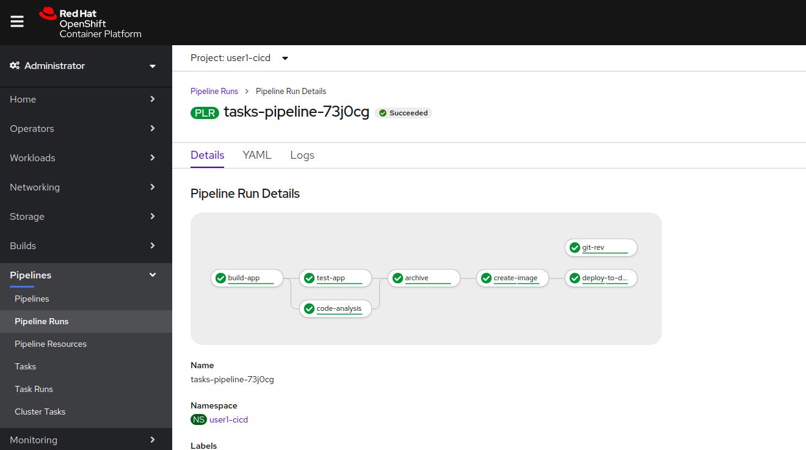

# Introduction

In this lab we will implement a new pipeline  that takes the results of testing the artifacts deployed to Dev and promotes them to the Stage environment. 


# Deployment Processes and Approvals

Let's step back a bit and review what we've done so far : we've taken the application in the state that it's in the source control repository and we've deployed it to a Dev environment. In a typical Software Development process, the Developers will implement the features. While doing so, they will write additional unit and integration tests and will run them as they're working on the code. 

We have reached a critical step : the pipeline that we've built so far, if successfully executed, proves that the source code can be turned into a runnable artifact. While doing so, the application has gone through a number of steps to validate the fitness of the application for being deployed - e.g. all tests pass, it doesn't violate any static analysis rules, etc. We have an application running on the platform where it will deploy in the future. 

At this point, there are other, more sophisticated tests that can be run against the application. For example, some level of end-to-end smoke testing could occur (where the application might integrate with other services), developers might do feature walkthroughs to make sure the feature is complete etc. Whenever the application passes the additional requirements, it is ready to proceed to the next step - deploying to a Staging environment. The Staging environment itself might be a place where yet more testing and verification occurs. 

In any case, the gap between "Deploy to Dev" and "Deploy to Stage" might require some additional approvals, be they manual or automatic. From that POV, we would likely want to have a different pipeline which would take a very specific validated version of the artifact that was deployed, and promote that to the Staging environment. 

An example of what that process might look like:
* An application reaches a stage where it's ready to deploy to the Dev environment. The pipeline is started and it deploys the application to Dev, at revision #1 of the source code. Some smoke testing occurs and reveals an issue in the app.
* The fixes are committed and the pipeline to deploy to dev is run again. It deploys a new version of the application, at revision #2 of the code. Smoke and integration testing completes successfully, and the application is approved to deploy to stage. 
* A new pipeline (deploy-to-stage) is kicked off to deploy the approved artifact (at revision #2)

In order to accomplish this, we will need to do the following:
* Modify the `tekton-tasks` pipeline to capture the git hash of the code that it is deploying. 
* Modify the `tekton-tasks` pipeline to tag the image that it creates with the git hash that it has deployed
* Create a new pipeline, `stage-tekton-tasks` to accept the approved version of the dev image to deploy, and to promote that version to the Stage environment. 

# Modify The `tekton-tasks` pipeline

The first problem that we need to solve is how to capture the Git hash of the source code the pipeline is working with and pass it on to the tasks that need it. At a command-line level, that's easy : we just need to run the following command in the source tree:
```bash
$ git rev-parse --verify --short HEAD
de7c044
```
We could use any container image that includes git, but we might as well use the one that comes with the Tekton project and is used in the `git-clone` ClusterTask in the OpenShift tasks catalog (
 `gcr.io/tekton-releases/github.com/tektoncd/pipeline/cmd/git-init:latest`). In a somewhat familiar turn of events, the `git-clone` task is useful, but not in the way that we expect. With that, here's an attempt at a task that does what we need. A few notable items:
* Here we're using a feature of Tekton that allows a Task to return a "result". Later, that result can be used in other tasks by using variable substitution using `$(tasks.<task-name>.results.<result-name>)`
```yaml
  apiVersion: tekton.dev/v1beta1
  kind: Task
  metadata:
    name: git-version
  spec:
    resources:
      inputs:
        - name: source
          type: git
    results:
      - description: The precise commit SHA in the git
        name: gitsha
    steps:
      - name: extract-git-rev
        image: 'gcr.io/tekton-releases/github.com/tektoncd/pipeline/cmd/git-init:latest'
        script: >
          #!/bin/sh

          set -e -o pipefail

          # get git sha

          git rev-parse --verify --short HEAD | tr -d '\n' | tee $(results.gitsha.path)
        workingDir: $(inputs.resources.source.path)
```


Let's test this task and make sure it gives us what we need:
```bash
tkn task start --inputresource source=tasks-source git-version --showlog 
Taskrun started: git-version-run-jwtkm
Waiting for logs to be available...

[extract-git-rev] 41fbfe7

```

So, now we need to integrate this task back into our pipeline. A few considerations:
* We will add the `git-version` task to the beginning of the pipeline
* We will modify the `create-image` and `deploy-to-dev` tasks to accept the git sha as a parameter so that they can use it to tag the image appropriately

Here is the modified `create-image` task. Notable items:
* After the image build completes, we add an extra command to tag the created / latest image with the gitsha that is passed in
```yaml
 apiVersion: tekton.dev/v1beta1
  kind: Task
  metadata:
    name: create-jboss-app-image
  spec:
    params:
      - default: tasks
        description: The name of the app
        name: app_name
        type: string
      - description: The name dev project
        name: dev_project
        type: string
      - description: binary artifact path in the local artifact repo
        # something like org/jboss/quickstarts/eap/jboss-tasks-rs/7.0.0-SNAPSHOT/jboss-tasks-rs-7.0.0-SNAPSHOT.war
        type: string
        name: artifact_path
      - description: The git revision/sha to tag the created image with
        type: string
        name: gitsha
    resources:
      inputs:
        - name: source
          type: git
    steps:
      - name: create-build-config
        image: 'quay.io/openshift/origin-cli:latest'
        script: >
          #!/bin/sh

          set -e -o pipefail

          echo "Creating new build config"  

          # This allows the new build to be created whether it exists or not

          oc new-build -o yaml --name=$(params.app_name) --image-stream=jboss-eap72-openshift:1.1  --binary=true -n
          $(params.dev_project) | oc apply -n $(params.dev_project) -f - 
      - name: build-app-image
        image: 'quay.io/openshift/origin-cli:latest'    
        script: >
          #!/bin/sh

          set -e -o pipefail

          echo "Start the openshift build"  


          rm -rf $(inputs.resources.source.path)/oc-build && mkdir -p $(inputs.resources.source.path)/oc-build/deployments 


          cp $(workspaces.maven-repo.path)/$(params.artifact_path) $(inputs.resources.source.path)/oc-build/deployments/ROOT.war 


          oc start-build $(params.app_name) --from-dir=$(inputs.resources.source.path)/oc-build -n $(params.dev_project) --wait=true 

          # Wait a moment for the image stream to be updated

          GITSHA='$(params.gitsha)' 

          echo "The git sha is $GITSHA but also $(params.gitsha)"

          oc tag $(params.app_name):latest $(params.app_name):$GITSHA -n $(params.dev_project) 

          echo "Successfully created container image $(params.dev_project)/$(params.app_name):$(params.gitsha)"
    workspaces:
      - name: maven-repo
```

Here's the updated version of the `deploy-to-dev` task. Notable items:
* The new deployment is created based on the image tagged with the gitsha passed in as a parameter
* We also add an extra step here to explicitly announce the gitsha that the application was deployed with, to be possibly used when running the stage pipeline

```yaml
  apiVersion: tekton.dev/v1beta1
  kind: Task
  metadata:
    name: deploy-to-dev
  spec:
    params:
      - description: The name of the app
        name: app_name
        type: string
      - description: The name of the dev project
        name: dev_project
        type: string
      - description: The git revision/sha to tag the created image with
        type: string
        name: gitsha
    resources:
      inputs:
        - name: source
          type: git
    steps:
      - name: deploy-app-from-image
        image: 'quay.io/openshift/origin-cli:latest'            
        script: >
          #!/bin/sh

          set -e -o pipefail

          echo "Create new app from image stream in $(params.dev_project) project"   

          oc new-app --image-stream=$(params.app_name):$(params.gitsha) -n
          $(params.dev_project) --as-deployment-config=true -o yaml | oc apply -n $(params.dev_project)  -f - 

          echo "Setting manual triggers on deployment $(params.app_name)"

          oc set triggers dc/$(params.app_name) --manual=true -n  $(params.dev_project) 

          if ! oc get route/$(params.app_name) -n $(params.dev_project) ; then

            oc expose svc $(params.app_name) -n $(params.dev_project) || echo "Failed to create route for $(params.app_name)"

          fi
            
          oc rollout latest dc/$(params.app_name) -n  $(params.dev_project)
      - name: announce-success
        image: 'gcr.io/tekton-releases/github.com/tektoncd/pipeline/cmd/git-init:latest'      
        script: >
          #!/bin/sh

          set -e -o pipefail

          echo "Successfully build application $(params.app_name)"

          echo "After testing the app, run the deploy-app-to-stage pipeline with
          $(params.gitsha) as the app_version parameter"
        workingDir: $(inputs.resources.source.path)    

```

Here's the modified `tasks-pipeline` would look like (unmodified sections are abbreviated, and the modified sections are included in full, replace the <user#> token with your username). A few notable items:
* The `git-version` task is not marked to run after any particular task. Based on the Tekton documentation, Tekton will schedule it to run before any tasks that require its results. 
* 
```yaml
apiVersion: tekton.dev/v1beta1
kind: Pipeline
metadata:
  name: tasks-pipeline
spec:
  resources:
    - name: tasks-source-code
      type: git

  workspaces:
    - name: local-maven-repo

  tasks:
    - name: build-app
      # ... snipped for brevity ... 
    - name: test-app
      # ... snipped for brevity .. 
    - name: code-analysis
      # ... snipped for brevity
    - name: archive
      # ... snipped for brevity
    - name: git-rev
      taskRef:
        kind: Task
        name: git-version
      resources:
        inputs:
          - name: source
            resource: tasks-source-code

    - name: create-image
      taskRef:
        kind: Task
        name: create-jboss-app-image
      params:
          - name: app_name
            value: tekton-tasks
          - name: dev_project
            value: <user#>-dev
          - name: artifact_path
            value: 'org/jboss/quickstarts/eap/jboss-tasks-rs/7.0.0-SNAPSHOT/jboss-tasks-rs-7.0.0-SNAPSHOT.war'
          - name: gitsha
            value: "$(tasks.git-rev.results.gitsha)"
      resources:
        inputs:
          - name: source
            resource: tasks-source-code
      workspaces:
        - name: maven-repo
          workspace: local-maven-repo
      runAfter:
          - archive


    - name: deploy-to-dev
      taskRef:
        kind: Task
        name: deploy-to-dev
      params:
          - name: app_name
            value: tekton-tasks
          - name: dev_project
            value: <user#>-dev
          - name: gitsha
            value: "$(tasks.git-rev.results.gitsha)"
      resources:
        inputs:
          - name: source
            resource: tasks-source-code
      runAfter:
          - create-image

```

With all these changes we can re-run our `tasks-pipeline` and observe the results. Notable items:
* The `git-rev` task gets run in parallel with the `build-app` task because it doesn't have any other dependencies it needs to wait for. It is truly beautiful that Tekton relieves us as the pipeline creators from figuring out the details of how to parallelize this work
* There is now a tag in the `
* The `deploy-to-dev` task runs the additional step and outputs the gitsha of the version it successfully deployed




# Create a `stage-tekton-tasks` pipeline

We've already done this work, so we can easily jump into creating a new task and a new pipeline to make this happen. 
```yaml
  apiVersion: tekton.dev/v1beta1
  kind: Task
  metadata:
    name: stage-tekton-tasks
  spec:
    params:
      - default: tasks
        description: The name of the app
        name: app_name
        type: string
      - description: The name dev project
        name: dev_project
        type: string
      - description: The name dev project
        name: stage_project
        type: string
      - description: The name dev project
        name: app_revision
        type: string
    steps:
    - name: cleanup-stage-project
      script: >
        #!/bin/sh

        set -e -o pipefail

        echo "Tagging image stream in 
        $(params.stage_project)/$(params.app_name):$(params.app_revision)"          

        oc tag
        $(params.dev_project)/$(params.app_name):$(params.app_revision)
        $(params.stage_project)/$(params.app_name):$(params.app_revision)          

        if oc get dc/$(params.app_name) -n $(params.stage_project); then

          echo "Tasks dc exists, cleaning up resources " 
          
          oc delete -n $(params.stage_project) dc/$(params.app_name) svc/$(params.app_name) route/$(params.app_name) || echo "Some resources didn't clean up as expected"; 

        fi

      image: 'quay.io/openshift/origin-cli:latest'

    - name: deploy-new-version-to-stage
      script: >
        #!/bin/sh

        set -e -o pipefail

        echo "Deploying new version into $(params.stage_project)  project "  

        oc new-app --image-stream=$(params.app_name):$(params.app_revision) -n $(params.stage_project) 
        --as-deployment-config=true -o yaml  | oc apply -n $(params.stage_project)  -f -   


        if ! oc get route/$(params.app_name) -n $(params.stage_project) ; then
          
          echo "Route not found, creating a new one" 

          oc expose svc $(params.app_name) -n  $(params.stage_project); 

        fi  

      image: 'quay.io/openshift/origin-cli:latest'

```

Then, we can add a new pipeline that uses this task (replace the <user#> token with your username):
```yaml
  apiVersion: tekton.dev/v1alpha1
  kind: Pipeline
  metadata:
    name: stage-tekton-tasks
  spec:
    params:
      - default: ''
        description: App version to deploy
        name: app_version
        type: string
    tasks:
      - name: deploy-app-to-stage
        taskRef:
          kind: Task
          name: deploy-app-to-stage
        params:
          - name: app_name
            value: tekton-tasks
          - name: dev_project
            value: <user#>-dev
          - name: stage_project
            value: <user#>-stage
          - name: app_revision
            value: $(params.app_version)
```

Review the oupput of the `tekton-tasks` pipeline - the last step in the last task announces the gitsha with which the image deployed in dev was tagged with. Take that git sha and run the `stage-tekton-tasks` pipeline with that as a parameter (replace the <gitsha_output> token with the value from your dev pipeline):
```bash
tkn pipeline start --param app_version=<gitsha_output> stage-tekton-tasks --showlog
```
When this pipeline completes running, you should find the same resources in the <user#>-stage project and will be able to open the route to the app and see it running

# Conclusion

In this lab we acquired the ability to promote an application from one project in OpenShift to another in order to illustrate how applications could move between stages. We updated our original pipeline to be yet more sophisticated, and we quickly put together a new pipeline that is started when the approval to deploy to stage is given. 